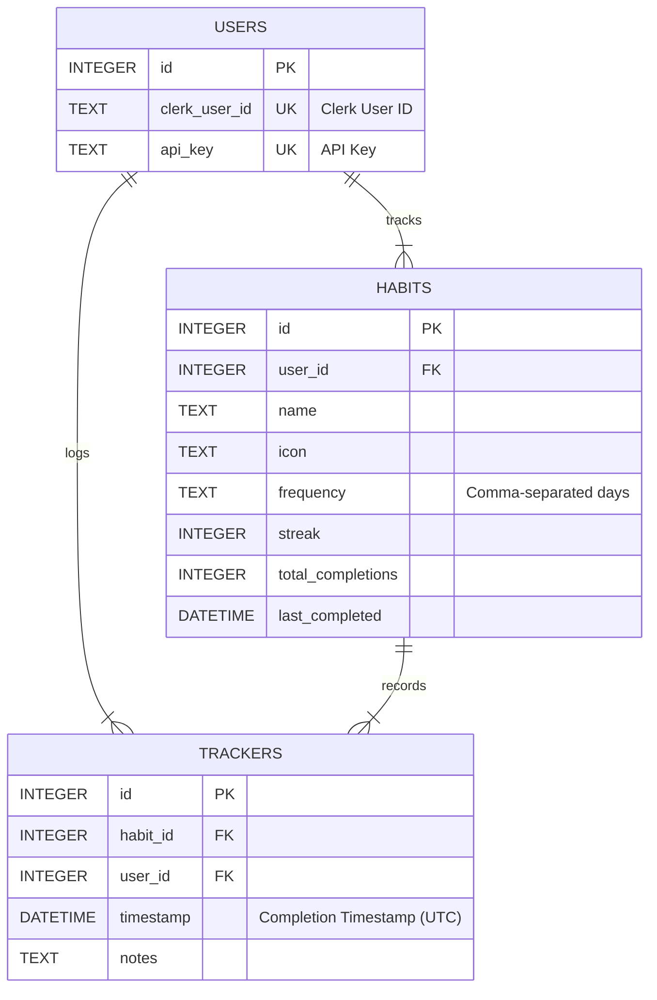

# Habit Tracker API

This is a RESTful API for a habit tracker application built with Node.js, Express.js, and SQLite.

## Features

- Create, Read, Update, and Delete (CRUD) habits.
- Track habit completions for specific dates (toggle on/off).
- Retrieve habit statistics (streak, total completions, last completed date).
- Secure endpoints using API Key authentication.

## Tech Stack

- **Backend:** Node.js
- **Framework:** Express.js
- **Database:** SQLite
- **Linting/Formatting:** ESLint, Prettier

## Visual Overview

### High-Level Architecture

```mermaid
graph LR
    Client -->|"HTTP Request\nGET POST PUT DELETE"| ExpressApp[Express App];
    ExpressApp -->|"Request"| Middleware["Middleware <br> (CORS, Helmet, JSON Parser, Auth)"];
    Middleware -->|"Authenticated Request"| Routes["API Routes <br> (/api/v1/...)"];
    Routes -->|"Params, Body"| Controller["Controller <br> (e.g., habit.controller.js)"];
    Controller -->|"Data Request"| Service["Service Layer <br> (e.g., habit.service.js)"];
    Service -->|"DB Operations"| Repository["Repository Layer <br> (e.g., habit.repository.js)"];
    Repository -->|"SQL Query"| DBUtils["DB Utils <br> (dbUtils.js)"];
    DBUtils -->|"Read/Write"| Database["(SQLite <br> tracknstick.db)"];
    Database -->|"Result Set"| DBUtils;
    DBUtils -->|"Data"| Repository;
    Repository -->|"Data"| Service;
    Service -->|"Processed Data"| Controller;
    Controller -->|"JSON Response"| ExpressApp;
    ExpressApp -->|"HTTP Response"| Client;

    subgraph "Application Layers"
        Controller
        Service
        Repository
        DBUtils
    end

    subgraph "Infrastructure"
        Database
    end
```



### Simplified Database ERD



## Authentication

All API endpoints require an API key for authentication. The API key must be sent in the `X-API-Key` header with each request.

## Prerequisites

- Node.js (v16 or later recommended)
- npm (usually included with Node.js)

## Setup and Installation

1.  **Clone the repository:**
    ```bash
    git clone https://github.com/jayvicsanantonio/tracknstick-api.git
    cd tracknstick-api
    ```
2.  **Install dependencies:**
    ```bash
    npm install
    ```
3.  **Set up environment variables:**
    - Create a `.env` file in the project root.
    - Add the following variables (adjust values as needed):
      ```dotenv
      PORT=3000
      NODE_ENV=development
      # Add any other necessary environment variables
      ```
4.  **Database Setup & API Key:**
    - The SQLite database file (`tracknstick.db`) and tables will be created automatically when the application first starts (via `src/utils/dbUtils.js`).
    - **Important:** You must manually add at least one user record with an API key to the `users` table to authenticate requests. Use a tool like DB Browser for SQLite or the `sqlite3` CLI:
      ```bash
      # Example using sqlite3 CLI (replace with your actual Clerk ID and desired API key)
      sqlite3 tracknstick.db "INSERT INTO users (clerk_user_id, api_key) VALUES ('user_your_clerk_id', 'your-secure-api-key');"
      ```

## Running the Application

- **Development Mode (with auto-restart via nodemon):**
  ```bash
  npm start
  ```
- **(Optional) Production Mode:**
  ```bash
  npm install --production
  NODE_ENV=production node index.js
  ```

The API will typically be available at `http://localhost:3000` (or the port specified in your `.env` file).

## Running Tests

```bash
npm test
```

_(Note: Test suite setup is pending)_

## API Documentation

For detailed endpoint specifications, request/response examples, and the full database schema, please see the **[API Documentation](.clinerules/api.md)**.

## Refactoring Overview

A significant refactoring effort was recently completed on this project with the primary goals of improving maintainability, testability, and performance, and establishing a scalable architecture.

Details about the refactoring process, architecture decisions, specific improvements, and learnings can be found in the `.clinerules` directory:

- [Architecture Decisions](.clinerules/architecture_decisions.md)
- [Maintainability Improvements](.clinerules/maintainability.md)
- [Enhancements & Future Work](.clinerules/enhancements.md)
- [Performance Optimizations](.clinerules/optimizations.md)
- [Learnings & Takeaways](.clinerules/learnings.md)

## Contributing

_(Add contribution guidelines if applicable)_

## License

_(Add license information if applicable, e.g., ISC)_
