# Habit Tracker API (TrackNStick API)

This is the RESTful API for the TrackNStick habit tracker application. It allows users to manage habits, track their completions, and view statistics about their progress. The API is designed to be robust, secure, and easy to use.

## Core Features

- **Habit Management**: Create, Read, Update, and Delete (CRUD) habits.
- **Habit Tracking**: Record habit completions for specific dates.
- **Statistics**: Retrieve habit statistics like current and longest streaks, total completions, and last completed date.
- **Progress Monitoring**: Track daily progress with completion rates.
- **Secure Authentication**: Endpoints are secured using Clerk JWT authentication.

## Tech Stack

- **Backend Runtime**: Node.js
- **Web Framework**: Hono.js (optimized for edge environments)
- **Database**: Cloudflare D1 (SQLite-compatible serverless database)
- **Deployment**: Cloudflare Workers
- **Language**: TypeScript
- **Linting/Formatting**: ESLint, Prettier

## High-Level Architecture

The API follows a layered architecture for separation of concerns and maintainability.

```mermaid
graph LR
    Client -->|"HTTP Request\nGET POST PUT DELETE"| HonoApp[Hono App on Cloudflare Workers];
    HonoApp -->|"Request"| Middleware["Global Middleware <br> (CORS, Auth, Logging, Error Handling)"];
    Middleware -->|"Processed Request"| Routes["API Routes <br> (e.g., /api/v1/habits)"];
    Routes -->|"Params, Body"| Controller["Controller Layer <br> (Handles HTTP, basic validation)"];
    Controller -->|"Calls Business Logic"| Service["Service Layer <br> (Core application logic)"];
    Service -->|"Requests Data"| Repository["Repository Layer <br> (Database interactions)"];
    Repository -->|"SQL Query"| D1["Cloudflare D1 Database"];
    D1 -->|"Query Result"| Repository;
    Repository -->|"Returns Data"| Service;
    Service -->|"Returns Processed Data"| Controller;
    Controller -->|"JSON Response"| HonoApp;
    HonoApp -->|"HTTP Response"| Client;
```



## Documentation

For detailed information about the API, development practices, and more, please refer to the following documents:

- **[Developer Guide (`docs/DEVELOPER_GUIDE.md`)](docs/DEVELOPER_GUIDE.md)**: The main comprehensive guide for developers. Includes setup, architecture, coding standards, and much more.
- **[API Endpoint Specifications (`docs/api/endpoints.md`)](docs/api/endpoints.md)**: Detailed information on all API endpoints, including request/response formats and examples.
- **[Database Schema (`docs/database/schema.md`)](docs/database/schema.md)**: Full details of the database structure, tables, and columns.
- **[Changelog (`CHANGELOG.md`)](CHANGELOG.md)**: A log of all notable changes, features, and fixes for each version of the API.

## Getting Started

To get started with development, including prerequisites, local setup, and running the application, please consult the **[Setup and Installation section in the Developer Guide](docs/DEVELOPER_GUIDE.md#3-getting-started-setup-and-installation)**.

## Authentication

API endpoints are protected using Clerk. Requests must include a valid JWT session token obtained from your Clerk frontend application in the `Authorization: Bearer <token>` header. More details can be found in the [Authentication section of the Developer Guide](docs/DEVELOPER_GUIDE.md#7-authentication-and-authorization).

## Google Calendar Integration
- See docs: `docs/google-calendar-setup.md`
- OAuth routes:
  - `GET /api/v1/google/auth` — Start Google OAuth (requires Clerk `Authorization` header)
  - `GET /api/v1/google/callback` — OAuth callback handler
- After connecting, habit create/update/delete will sync recurring events to the user's primary Google Calendar.

## Running Tests

To run the automated tests:
```