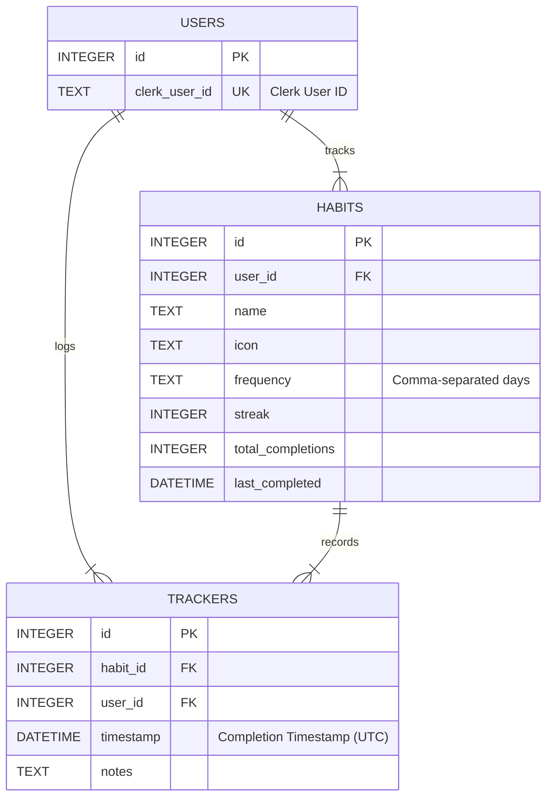

# Habit Tracker API

This is a RESTful API for a habit tracker application built with Node.js, Express.js, and SQLite.

## Features

- Create, Read, Update, and Delete (CRUD) habits.
- Track habit completions for specific dates (toggle on/off).
- Retrieve habit statistics (streak, total completions, last completed date).
- Secure endpoints using Clerk JWT authentication.

## Tech Stack

- **Backend:** Node.js
- **Framework:** Hono.js
- **Database:** Cloudflare D1 (SQLite)
- **Deployment:** Cloudflare Workers
- **Linting/Formatting:** ESLint, Prettier

## Visual Overview

### High-Level Architecture

```mermaid
graph LR
    Client -->|"HTTP Request\nGET POST PUT DELETE"| HonoApp[Hono App];
    HonoApp -->|"Request"| Middleware["Middleware <br> (CORS, Authentication)"];
    Middleware -->|"Authenticated Request"| Routes["API Routes <br> (/api/v1/...)"];
    Routes -->|"Params, Body"| Controller["Controller <br> (e.g., habit.controller.ts)"];
    Controller -->|"Data Request"| Service["Service Layer <br> (e.g., habit.service.ts)"];
    Service -->|"DB Operations"| Repository["Repository Layer <br> (e.g., habit.repository.ts)"];
    Repository -->|"SQL Query"| D1["Cloudflare D1 <br> (SQLite-compatible)"];
    D1 -->|"Result Set"| Repository;
    Repository -->|"Data"| Service;
    Service -->|"Processed Data"| Controller;
    Controller -->|"JSON Response"| HonoApp;
    HonoApp -->|"HTTP Response"| Client;

    subgraph "Application Layers"
        Controller
        Service
        Repository
    end

    subgraph "Infrastructure"
        D1
    end
```



### Simplified Database ERD



## Authentication

API endpoints are protected using Clerk. Requests must include a valid JWT session token obtained from your Clerk frontend application in the `Authorization: Bearer <token>` header. The backend verifies this token using the `@clerk/express` middleware.

## Rate Limiting

To prevent abuse, API requests are rate-limited. By default, each IP address is allowed 100 requests per 15-minute window. If the limit is exceeded, a `429 Too Many Requests` error will be returned.

## Prerequisites

- Node.js (v16 or later recommended)
- npm (usually included with Node.js)

## Setup and Installation

1.  **Clone the repository:**
    ```bash
    git clone https://github.com/jayvicsanantonio/tracknstick-api.git
    cd tracknstick-api
    ```
2.  **Install dependencies:**
    ```bash
    npm install
    ```
3.  **Set up environment variables:**

    - Create a `.env` file in the project root.
    - Add the following variables (adjust values as needed):

      ```bash
      PORT=3000
      NODE_ENV=development

      # Clerk API Keys (Get from Clerk Dashboard)
      CLERK_SECRET_KEY=sk_test_YOUR_SECRET_KEY_HERE
      CLERK_PUBLISHABLE_KEY=pk_test_YOUR_PUBLISHABLE_KEY_HERE

      # Optional: Database Path
      DATABASE_PATH=./tracknstick.db

      # Optional: Rate Limiting
      RATE_LIMIT_WINDOW_MS=900000
      RATE_LIMIT_MAX_REQUESTS=100
      ```

    - **Important:** Replace the placeholder Clerk keys with your actual keys.

4.  **Database Setup:**

    - The database schema is managed using Cloudflare D1 migrations.
    - Run the following commands to set up the database and apply migrations:

      ```bash
      # Set up initial schema
      npm run db:migrate

      # Apply additional migrations (indexes)
      wrangler d1 execute tracknstick-db --file=./migrations/0001_add_indexes.sql
      ```

    - **Important:** This must be done before starting the application.

## Running the Application

- **Development Mode with Local D1 Database:**
  ```bash
  npm run dev:local
  ```
- **Development Mode with Remote D1 Database:**
  ```bash
  npm run dev
  ```
- **Production Deployment:**
  ```bash
  npm run deploy
  ```

The API will be available at `http://localhost:3000` when running in development mode.

## Database Migrations

Database schema changes are managed using Cloudflare D1 migrations:

- **Apply Migrations Locally:**
  ```bash
  npm run db:migrate
  ```
- **Apply Migrations to Remote Database:**
  ```bash
  npm run db:migrate:remote
  ```
- **Execute SQL Queries Locally:**
  ```bash
  npm run db:query -- "SELECT * FROM users"
  ```
- **Execute SQL Queries on Remote Database:**
  ```bash
  npm run db:query:remote -- "SELECT * FROM users"
  ```

## Running Tests

```bash
npm test
```

_(Note: Test suite setup is pending)_

## API Documentation

For detailed endpoint specifications, request/response examples, and the full database schema, please see the **[API Documentation](docs/api/implementation.md)**.

Additional documentation can be found in the `docs` directory:

- [Architecture Decisions](docs/architecture/decisions.md)
- [Coding Standards](docs/development/coding-standards.md)
- [Maintainability Improvements](docs/development/maintainability.md)
- [Enhancements & Future Work](docs/development/enhancements.md)
- [Performance Optimizations](docs/development/optimizations.md)
- [Learnings & Takeaways](docs/development/learnings.md)

## Refactoring Overview

A significant refactoring effort was recently completed on this project with the primary goals of improving maintainability, testability, and performance, and establishing a scalable architecture.

Details about the refactoring process, architecture decisions, specific improvements, and learnings can be found in the `docs` directory:

- [Architecture Decisions](docs/architecture/decisions.md)
- [Maintainability Improvements](docs/development/maintainability.md)
- [Enhancements & Future Work](docs/development/enhancements.md)
- [Performance Optimizations](docs/development/optimizations.md)
- [Learnings & Takeaways](docs/development/learnings.md)

## Contributing

_(Add contribution guidelines if applicable)_

## License

_(Add license information if applicable, e.g., ISC)_
