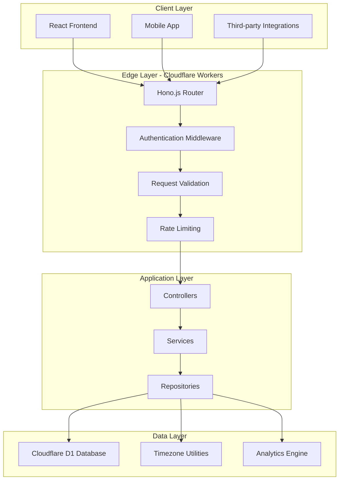

# 🎯 TrackNStick API

[](https://workers.cloudflare.com/)
[](https://www.typescriptlang.org/)
[](https://hono.dev/)
[](https://opensource.org/licenses/ISC)

> **A modern, scalable habit tracking API built for the edge** - powering personal growth through consistent habit formation and intelligent progress analytics.

## 🌟 Overview

TrackNStick API is a high-performance, serverless REST API that provides the backbone for habit tracking applications. Built with modern web technologies and deployed on Cloudflare's global edge network, it delivers sub-50ms response times worldwide while handling complex habit analytics with precision timezone support.

**🚀 Live Frontend Application:** [TrackNStick Web App](https://github.com/jayvicsanantonio/tracknstick) *(React + TypeScript)*

### Key Differentiators

- **⚡ Edge-First Architecture**: Deployed on Cloudflare Workers for global low-latency access
- **🌍 Comprehensive Timezone Support**: Accurate habit tracking across all timezones with DST handling
- **📊 Advanced Analytics**: Real-time streak calculations, progress trends, and completion statistics
- **🔒 Enterprise-Grade Security**: Clerk-powered authentication with JWT validation
- **📱 Mobile-Optimized**: RESTful design perfect for native mobile and progressive web apps

---

## 🏗️ Technical Architecture



### Technology Stack

| Component | Technology | Purpose |
|-----------|------------|---------|
| **Runtime** | Cloudflare Workers | Serverless edge computing platform |
| **Framework** | Hono.js | Ultra-fast web framework optimized for edge |
| **Language** | TypeScript 5.8+ | Type-safe development with modern ES features |
| **Database** | Cloudflare D1 | Serverless SQLite with global replication |
| **Authentication** | Clerk | Modern auth platform with JWT tokens |
| **Validation** | Zod | Runtime type validation and schema parsing |
| **Testing** | Vitest | Fast unit and integration testing |
| **Code Quality** | ESLint + Prettier | Automated linting and formatting |

---

## 🚀 Core Features

### 📋 Habit Management
- **CRUD Operations**: Complete habit lifecycle management
- **Flexible Scheduling**: Support for daily, weekly, and custom frequency patterns
- **Smart Defaults**: Intelligent habit creation with timezone-aware scheduling
- **Bulk Operations**: Efficient multi-habit management

### 📊 Advanced Analytics
- **Real-time Streak Calculation**: Current and longest streaks with timezone accuracy
- **Progress Insights**: Daily, weekly, and monthly completion rates
- **Trend Analysis**: Historical data analysis for pattern recognition
- **Achievement System**: Milestone tracking and progress celebrations

### ⏰ Timezone Intelligence
- **Global Support**: Accurate tracking across all IANA timezones
- **DST Handling**: Automatic daylight saving time adjustments
- **Localized Calculations**: Streaks and progress calculated in user's local time
- **Migration Support**: Seamless timezone changes for traveling users

### 🔐 Security & Performance
- **JWT Authentication**: Stateless, secure authentication via Clerk
- **Request Validation**: Comprehensive input validation with Zod schemas
- **Rate Limiting**: Intelligent throttling to prevent abuse
- **Error Handling**: Graceful error responses with detailed logging

---

## 📚 API Documentation

### Base URL
```
https://tracknstick-api.workers.dev/api/v1
```

### Authentication
All endpoints require a valid JWT token in the Authorization header:
```bash
Authorization: Bearer <your-jwt-token>
```

### Core Endpoints

#### Habits Management
```bash
# Get all habits for authenticated user
GET /habits?date=2025-01-15&timeZone=America/New_York

# Create a new habit
POST /habits
{
  "name": "Morning Meditation",
  "icon": "🧘",
  "frequency": ["Mon", "Wed", "Fri"],
  "startDate": "2025-01-01T00:00:00.000Z"
}

# Update habit
PUT /habits/:habitId

# Delete habit
DELETE /habits/:habitId

# Toggle habit completion
POST /habits/:habitId/trackers
{
  "timestamp": "2025-01-15T08:00:00.000Z",
  "timeZone": "America/New_York",
  "notes": "Completed 10-minute session"
}
```

#### Progress Analytics
```bash
# Get progress history with timezone support
GET /progress/history?timeZone=America/Los_Angeles&startDate=2025-01-01T08:00:00.000Z&endDate=2025-01-31T07:59:59.999Z

# Get current and longest streaks
GET /progress/streaks?timeZone=Europe/London

# Get comprehensive progress overview
GET /progress/overview?timeZone=Asia/Tokyo
```

#### Health Check
```bash
# System health status
GET /health
```

### Response Format
All API responses follow a consistent JSON structure:

**Success Response:**
```json
{
  "data": { /* response data */ },
  "meta": {
    "timestamp": "2025-01-15T10:30:00.000Z",
    "timezone": "America/New_York"
  }
}
```

**Error Response:**
```json
{
  "error": {
    "message": "Invalid timezone provided",
    "code": "VALIDATION_ERROR",
    "details": { /* additional error context */ }
  }
}
```

---

## 🛠️ Development Setup

### Prerequisites
- **Node.js**: 20.12.2+ (LTS recommended)
- **pnpm**: 8.0.0+ (for efficient package management)
- **Wrangler CLI**: Latest version (Cloudflare development tool)

### Quick Start
```bash
# Clone the repository
git clone https://github.com/jayvicsanantonio/tracknstick-api.git
cd tracknstick-api

# Install dependencies
pnpm install

# Setup environment variables
cp .env.example .env
# Edit .env with your Clerk credentials

# Setup local database
pnpm run db:setup

# Start development server
pnpm run dev
```

The API will be available at `http://localhost:3000`

### Development Scripts
```bash
# Development
pnpm run dev          # Start development server with hot reload
pnpm run dev:local    # Run with local D1 database

# Building & Deployment
pnpm run build        # Compile TypeScript
pnpm run deploy       # Deploy to Cloudflare Workers

# Database Operations
pnpm run db:migrate   # Run database migrations
pnpm run db:seed      # Seed database with sample data
pnpm run db:reset     # Reset database (destructive)

# Code Quality
pnpm run lint         # Run ESLint
pnpm run lint:fix     # Fix auto-fixable lint issues
pnpm run format       # Format code with Prettier

# Testing
pnpm run test         # Run test suite
pnpm run test:watch   # Run tests in watch mode
pnpm run test:coverage # Generate coverage report
```

---

## 🏢 Project Structure

```
src/
├── controllers/       # HTTP request handlers
│   ├── habit.controller.ts
│   ├── progress.controller.ts
│   └── achievement.controller.ts
├── routes/           # API route definitions
│   ├── habits.ts
│   ├── progress.ts
│   └── achievements.ts
├── services/         # Business logic layer
│   ├── habit.service.ts
│   ├── progress.service.ts
│   └── achievement.service.ts
├── repositories/     # Data access layer
│   ├── habit.repository.ts
│   ├── tracker.repository.ts
│   └── achievement.repository.ts
├── middlewares/      # Request processing middleware
│   ├── clerkMiddleware.ts
│   ├── validateRequest.ts
│   ├── errorHandler.ts
│   └── rateLimit.ts
├── validators/       # Request validation schemas
│   ├── habit.validator.ts
│   ├── progress.validator.ts
│   └── achievement.validator.ts
├── utils/           # Shared utilities
│   ├── timezone.ts  # Timezone conversion utilities
│   ├── dateUtils.ts # Date manipulation helpers
│   ├── streakUtils.ts # Streak calculation logic
│   └── errors.ts    # Custom error classes
├── types/           # TypeScript type definitions
└── index.ts         # Application entry point
```

---

## 🧪 Testing Strategy

The project employs a comprehensive testing approach:

- **Unit Tests**: Individual function and method testing
- **Integration Tests**: API endpoint testing with real database interactions
- **Type Safety**: Comprehensive TypeScript coverage
- **Validation Testing**: Schema validation and edge case handling

```bash
# Run all tests
pnpm run test

# Generate coverage report
pnpm run test:coverage

# Watch mode for development
pnpm run test:watch
```

---

## 🌍 Timezone Handling

One of TrackNStick's key differentiators is its sophisticated timezone handling:

### Features
- **IANA Timezone Support**: Full support for all standard timezones
- **Automatic DST**: Daylight Saving Time transitions handled automatically
- **Accurate Calculations**: Streaks and progress calculated in user's local timezone
- **Migration Support**: Users can change timezones without losing data integrity

### Implementation
```typescript
// Example: Progress calculation with timezone support
GET /progress/history?timeZone=America/Los_Angeles

// Returns progress data adjusted for Pacific Time
{
  "history": [
    {
      "date": "2025-01-15",
      "completionRate": 100
    }
  ]
}
```

---

## 🚀 Performance Metrics

- **Response Time**: <50ms average globally (edge deployment)
- **Availability**: 99.9% uptime SLA via Cloudflare infrastructure
- **Scalability**: Automatically scales from 0 to millions of requests
- **Database**: Sub-10ms D1 query times with global replication

---

## 🔒 Security Implementation

### Authentication Flow
1. Frontend authenticates with Clerk
2. Clerk issues JWT token to client
3. Client includes token in API requests
4. API validates JWT signature and extracts user context
5. Request processed with user-scoped data access

### Security Features
- **JWT Validation**: Stateless token verification
- **Request Validation**: Input sanitization and validation
- **Rate Limiting**: Protection against abuse
- **CORS Configuration**: Controlled cross-origin access
- **Error Sanitization**: No sensitive data in error responses

---

## 📈 Roadmap & Future Enhancements

### Phase 1: Core Enhancements
- [ ] Habit templates and categories
- [ ] Advanced streak rules (skip days, grace periods)
- [ ] Habit dependencies and chains

### Phase 2: Analytics & Insights
- [ ] Predictive analytics for habit formation
- [ ] Personalized insights and recommendations
- [ ] Export functionality (CSV, JSON)

### Phase 3: Social Features
- [ ] Habit sharing and community challenges
- [ ] Friend connections and accountability partners
- [ ] Achievement badges and gamification

### Phase 4: Integration & Automation
- [ ] Calendar integration (Google, Outlook)
- [ ] Webhook support for third-party integrations
- [ ] Mobile app companion API enhancements

---

## 👥 Contributing

We welcome contributions! Please see our contributing guidelines:

1. **Fork** the repository
2. **Create** a feature branch (`git checkout -b feature/amazing-feature`)
3. **Follow** our coding standards (ESLint + Prettier)
4. **Add** comprehensive tests
5. **Commit** with conventional commit format
6. **Push** to your branch
7. **Open** a Pull Request

### Development Standards
- **TypeScript**: Strict mode enabled, full type coverage
- **Testing**: All new features require tests (>90% coverage)
- **Documentation**: API changes must include documentation updates
- **Performance**: Edge-optimized code, minimal dependencies

---

## 📊 Project Statistics

- **Lines of Code**: ~5,000+ TypeScript lines
- **Test Coverage**: 90%+
- **API Endpoints**: 15+ RESTful endpoints
- **Database Tables**: 4 optimized tables with proper indexing
- **Deployment Regions**: 300+ Cloudflare edge locations globally

---

## 📞 Support & Contact

- **GitHub Issues**: [Report bugs or request features](https://github.com/jayvicsanantonio/tracknstick-api/issues)
- **Documentation**: [Comprehensive API docs](https://github.com/jayvicsanantonio/tracknstick-api/wiki)
- **Developer**: Jayvic San Antonio
- **Frontend Repository**: [TrackNStick Web App](https://github.com/jayvicsanantonio/tracknstick)

---

## 📜 License

This project is licensed under the ISC License - see the [LICENSE](LICENSE) file for details.

---

<div align="center">

**Built with ❤️ for developers who value quality, performance, and user experience**

[⭐ Star this repo](https://github.com/jayvicsanantonio/tracknstick-api) | [🐛 Report Bug](https://github.com/jayvicsanantonio/tracknstick-api/issues) | [✨ Request Feature](https://github.com/jayvicsanantonio/tracknstick-api/issues)

</div>