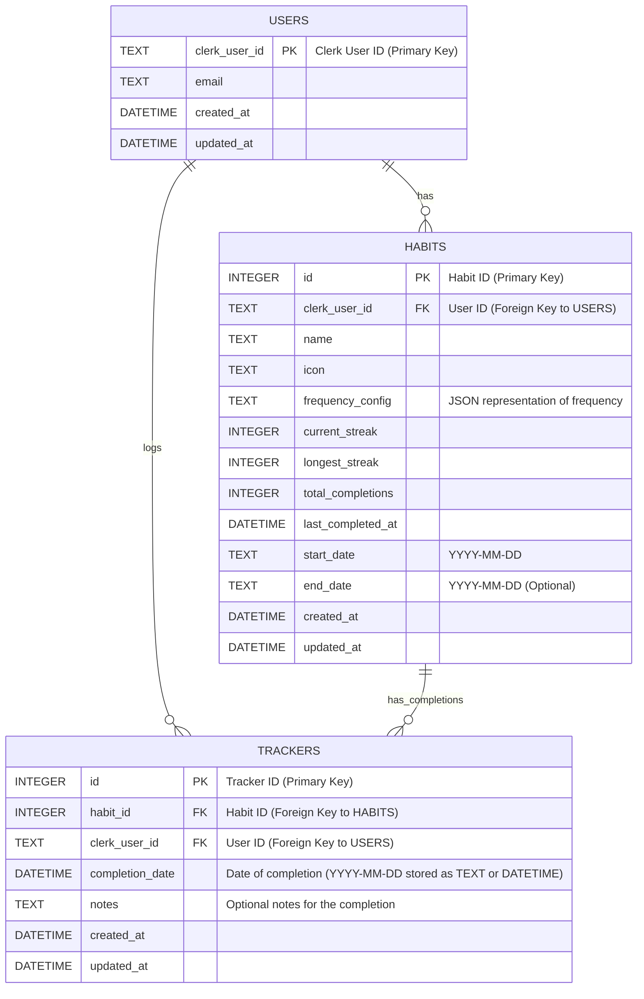
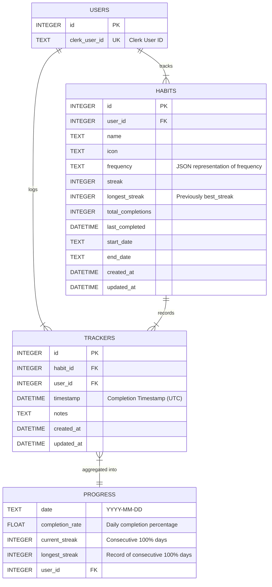

# TrackNStick API - Developer Guide

Welcome to the TrackNStick API! This guide is designed to help you understand the project, get your development environment set up, and contribute effectively, whether you're new to the team or just need a refresher.

## Table of Contents

- [1. Project Overview](#1-project-overview)
  - [1.1. What is TrackNStick API?](#11-what-is-tracknstick-api)
  - [1.2. Core Features](#12-core-features)
  - [1.3. Tech Stack](#13-tech-stack)
- [2. System Architecture](#2-system-architecture)
  - [2.1. Layered Architecture Explained](#21-layered-architecture-explained)
  - [2.2. Visual Overview](#22-visual-overview)
  - [2.3. Main Entry Point (`src/index.ts`)](#23-main-entry-point-srcindexts)
  - [2.4. Component Layers and Responsibilities](#24-component-layers-and-responsibilities)
- [3. Getting Started: Setup and Installation](#3-getting-started-setup-and-installation)
  - [3.1. Prerequisites](#31-prerequisites)
  - [3.2. Step 1: Clone the Repository](#32-step-1-clone-the-repository)
  - [3.3. Step 2: Install Dependencies](#33-step-2-install-dependencies)
  - [3.4. Step 3: Configure Environment Variables](#34-step-3-configure-environment-variables)
  - [3.5. Step 4: Set Up Cloudflare D1 Database](#35-step-4-set-up-cloudflare-d1-database)
  - [3.6. Step 5: Start the Development Server](#36-step-5-start-the-development-server)
  - [3.7. Step 6: Linting and Testing](#37-step-6-linting-and-testing)
  - [3.8. Recommended VS Code Extensions](#38-recommended-vs-code-extensions)
- [4. Directory Structure](#4-directory-structure)
- [5. Key Components In-Depth](#5-key-components-in-depth)
  - [5.1. Routes](#51-routes)
  - [5.2. Controllers](#52-controllers)
  - [5.3. Services](#53-services)
  - [5.4. Repositories](#54-repositories)
- [6. Configuration Management](#6-configuration-management)
  - [6.1. Environment Variables (`.dev.vars`)](#61-environment-variables-devvars)
  - [6.2. Cloudflare Workers Configuration (`wrangler.toml`)](#62-cloudflare-workers-configuration-wranglertoml)
- [7. Authentication and Authorization](#7-authentication-and-authorization)
  - [7.1. Overview with Clerk](#71-overview-with-clerk)
  - [7.2. Authentication Flow Explained](#72-authentication-flow-explained)
  - [7.3. Backend Implementation (`clerkMiddleware`)](#73-backend-implementation-clerkmiddleware)
  - [7.4. Frontend Integration Example](#74-frontend-integration-example)
  - [7.5. Security Notes on JWTs](#75-security-notes-on-jwts)
  - [7.6. Handling Authentication Errors](#76-handling-authentication-errors)
  - [7.7. Authorization Strategy](#77-authorization-strategy)
- [8. Error Handling Strategy](#8-error-handling-strategy)
- [9. Logging Practices](#9-logging-practices)
- [10. API Request Flow (End-to-End)](#10-api-request-flow-end-to-end)
- [11. Data Validation](#11-data-validation)
- [12. Testing Strategy](#12-testing-strategy)
  - [12.1. Unit Tests](#121-unit-tests)
  - [12.2. Integration Tests](#122-integration-tests)
- [13. Database Interactions and Migrations](#13-database-interactions-and-migrations)
  - [13.1. Database Interactions with D1](#131-database-interactions-with-d1)
  - [13.2. Simplified ERD](#132-simplified-erd)
  - [13.3. Database Transactions](#133-database-transactions)
  - [13.4. Database Migrations](#134-database-migrations)
- [14. API Versioning](#14-api-versioning)
- [15. Security Best Practices](#15-security-best-practices)
  - [15.1. Secure Headers](#151-secure-headers)
  - [15.2. CORS Configuration](#152-cors-configuration)
  - [15.3. Rate Limiting](#153-rate-limiting)
- [16. Common Developer Workflows](#16-common-developer-workflows)
  - [16.1. Adding a New API Endpoint](#161-adding-a-new-api-endpoint)
  - [16.2. Changing the Database Schema](#162-changing-the-database-schema)
- [17. Debugging and Troubleshooting](#17-debugging-and-troubleshooting)
  - [17.1. Local Development Debugging](#171-local-development-debugging)
  - [17.2. Common Issues](#172-common-issues)
- [18. Documentation Standards](#18-documentation-standards)
- [19. Code Review Process](#19-code-review-process)
- [20. Understanding Past Database Schema Changes (May 2023)](#20-understanding-past-database-schema-changes-may-2023)
- [21. Development Practices and Standards](#21-development-practices-and-standards)
- [22. Further Reading and Other Key Resources](#22-further-reading-and-other-key-resources)

## 1. Project Overview

### 1.1. What is TrackNStick API?

The TrackNStick API is the backend engine for the TrackNStick habit tracking application. It's a RESTful service, meaning it uses standard web protocols (like HTTP) to provide data to clients (like our web app). Its main job is to manage user habits, track their progress, and provide data for analytics, helping users build and maintain positive habits.

### 1.2. Core Features

The API offers several key functionalities:

*   **Habit Management**: Allows users to create, view, update, and delete their habits (standard CRUD operations).
*   **Habit Tracking**: Enables users to mark habits as completed for specific dates.
*   **Analytics & Statistics**: Calculates and provides data like current streaks, longest streaks, total completions, and the last date a habit was completed.
*   **Progress Monitoring**: Helps users see their daily progress through completion rates and ongoing streaks.
*   **Historical Data**: Lets users look back at their completion history, often shown as daily percentages.
*   **Authentication**: Ensures that all API endpoints are secure, using Clerk for JWT (JSON Web Token) based authentication.
*   **User Management**: Relies on Clerk to handle user accounts, but the API ensures that users can only access and modify their own data.

### 1.3. Tech Stack

The primary technologies used to build this API are:

*   **Runtime**: Node.js (a JavaScript runtime for server-side development)
*   **Framework**: Hono.js (a small, fast, and modern web framework, particularly well-suited for edge environments like Cloudflare Workers)
*   **Database**: Cloudflare D1 (a serverless SQLite database provided by Cloudflare)
*   **Deployment**: Cloudflare Workers (a serverless platform that runs code close to users for better performance)
*   **Language**: TypeScript (a superset of JavaScript that adds static typing for better code quality and maintainability)

## 2. System Architecture

### 2.1. Layered Architecture Explained

Our API uses a **layered architecture**. Think of it like a cake with different layers, where each layer has a specific job. This design helps us keep the code organized, makes it easier to test individual parts, and allows us to update or scale the application more effectively.

**Why use a Layered Architecture?**

*   **Separation of Concerns**: Each part of the system (like handling web requests, applying business rules, or talking to the database) has its own distinct area. This makes it clear where to find specific code and what each part does.
*   **Maintainability**: When code for different jobs is separate, it's easier to make changes or fix bugs in one area without accidentally breaking another.
*   **Testability**: We can test each layer independently. For example, we can test the business logic (in "Services") without needing a real database, by using "mock" (simulated) data providers.
*   **Scalability**: As the application grows, this organized structure helps us add new features or handle more users without the codebase becoming chaotic.

### 2.2. Visual Overview

The following diagram shows how a request flows through the different layers of the API:

```mermaid
graph LR
    Client([Client App e.g., Web Browser]) -->|"HTTP Request (GET, POST, etc.)"| HonoApp[Hono Application];
    HonoApp -->|1. Request Received| Middleware["Global Middleware <br> (Logging, CORS, Security Headers, Error Handling, Initial Bindings)"];
    Middleware -->|2. Processed Request| Routes["API Routes <br> (e.g., /api/v1/habits)"];
    Routes -->|3. Matched Route| Controller["Controller Layer <br> (e.g., habit.controller.ts) <br> Handles HTTP, validates input"];
    Controller -->|4. Calls Business Logic| Service["Service Layer <br> (e.g., habit.service.ts) <br> Implements core application logic"];
    Service -->|5. Requests Data| Repository["Repository Layer <br> (e.g., habit.repository.ts) <br> Manages data access"];
    Repository -->|6. SQL Query| Database[("Cloudflare D1 <br> (SQLite Database)")];
    Database -->|7. Query Result| Repository;
    Repository -->|8. Returns Data| Service;
    Service -->|9. Returns Processed Data| Controller;
    Controller -->|10. Sends JSON Response| HonoApp;
    HonoApp -->|"HTTP Response"| Client;

    subgraph "Application Code Layers"
        Controller
        Service
        Repository
    end

    subgraph "External Systems"
        Database
    end
```



### 2.3. Main Entry Point (`src/index.ts`)

The heart of our application is the `src/index.ts` file. This is where the Hono web server is initialized and configured. Key responsibilities of this file include:

*   Creating the main Hono application instance.
*   Applying **global middleware**: These are functions that process every request before it reaches the main business logic. Examples include:
    *   `requestLogger`: Logs incoming requests.
    *   `secureHeaders`: Adds HTTP headers that enhance security.
    *   `initBindings`: Sets up initial context or bindings needed by the application.
    *   `cors`: Configures Cross-Origin Resource Sharing (important for allowing web frontends from different domains to access the API).
    *   `errorHandler`: A global mechanism to catch and process any errors that occur during request handling.
*   **Registering API routes**: This tells the Hono app how to direct incoming URLs (like `/api/v1/habits`) to the correct handler functions.
*   Defining a **404 handler** for requests that don't match any defined routes.
*   Exporting the configured Hono app, which is then used by the Cloudflare Workers runtime.

```typescript
// Example: src/index.ts
import { Hono } from 'hono';
// ... other imports for middleware and routes ...
import { cors } from 'hono/cors';
import { secureHeaders } from 'hono/secure-headers';
import { D1Database } from '@cloudflare/workers-types';
import { habitRoutes } from './routes/habits.js';
import { healthRoutes } from './routes/health.js';
import { errorHandler } from './middlewares/errorHandler.js';
import { requestLogger } from './middlewares/requestLogger.js';
import { initBindings } from './middlewares/initBindings.js';
import logger from './utils/logger.js';

// Create the main Hono app instance
const app = new Hono<{ Bindings: Bindings }>(); // `Bindings` often defines expected environment variables like DB

// Apply global middlewares (examples)
app.use('*', requestLogger());        // Log every request
app.use('*', secureHeaders());        // Add security-related headers
app.use('*', initBindings());         // Initialize any required bindings or context for requests
app.use(
  '*',
  cors({                              // Configure CORS
    origin: ['http://localhost:5173', 'https://tracknstick.com'], // Allowed origins
    allowMethods: ['GET', 'POST', 'PUT', 'DELETE'],
    allowHeaders: ['Content-Type', 'Authorization'],
    maxAge: 86400, // Cache CORS preflight response for 1 day
  })
);

// Set up API routes
app.route('/api/v1/habits', habitRoutes); // All requests to /api/v1/habits are handled by habitRoutes
app.route('/health', healthRoutes);       // Health check endpoint

// Global 404 handler (if no route matches)
app.notFound((c) => {
  return c.json({ error: { message: 'Not Found', code: 'not_found' } }, 404);
});

// Register the global error handler (must be last)
app.onError(errorHandler);

export default app; // Export the app for the Cloudflare Worker runtime
```

### 2.4. Component Layers and Responsibilities

Our layered architecture consists of several key types of components, each with a specific role:

1.  **Routes (`src/routes/`)**:
    *   **Job**: Define the API's URLs (endpoints) and which HTTP methods (GET, POST, PUT, DELETE) they respond to.
    *   **Details**: They map incoming requests to the correct controller functions. They can also apply middleware that is specific to a particular set of routes (e.g., input validation for creating a new habit).
    *   **Rule**: Routes should *not* contain any business logic themselves; they are just the entry points.

2.  **Controllers (`src/controllers/`)**:
    *   **Job**: Act as the traffic cops for incoming requests. They manage the HTTP request and response.
    *   **Details**: Controllers extract necessary information from the request (like user input from the request body or URL parameters). They perform very basic validation on this input. Then, they call the appropriate "Service" to do the actual work. Finally, they format the data received from the service and send it back to the client as an HTTP response (usually in JSON format).
    *   **Rule**: Controllers should be "thin," meaning they don't do much heavy lifting. They delegate business logic to Services and pass errors to the central error handler.

3.  **Services (`src/services/`)**:
    *   **Job**: This is where the main "brain" of the application lives – the core business logic.
    *   **Details**: Services implement the application's rules, workflows, and use cases. For example, a `HabitService` might contain logic for calculating a user's habit streak. They orchestrate calls to "Repositories" to get or save data. They might also transform data or perform more complex validation that requires business context.
    *   **Rule**: Services should *not* directly access the database; they use Repositories for that. They can throw custom errors if something goes wrong according to business rules.

4.  **Repositories (`src/repositories/`)**:
    *   **Job**: Manage all communication with the database.
    *   **Details**: Repositories contain the actual SQL queries or methods to perform database operations (Create, Read, Update, Delete – often called CRUD operations). They fetch data from the database and return it as plain data objects, or they take data from Services and save it to the database.
    *   **Rule**: Repositories should *only* deal with data access. They should not contain any business logic.

5.  **Validators (`src/validators/`)**:
    *   **Job**: Define the rules for what valid input data looks like.
    *   **Details**: They ensure that data sent by clients (e.g., in a POST request to create a new habit) is in the correct format and meets predefined criteria (e.g., a habit name must be a string and cannot be empty).

6.  **Middlewares (`src/middlewares/`)**:
    *   **Job**: These are functions that can process requests *before* they reach the main route handler (controller) or *before* a response is sent back.
    *   **Details**: Middlewares are used for tasks that apply to many different routes (cross-cutting concerns). Examples include:
        *   `clerkMiddleware.ts`: Handles authentication by checking the user's token.
        *   `requestLogger.ts`: Logs details about each incoming request.
        *   `errorHandler.ts`: Catches any errors that occur and sends a standardized error response.
        *   CORS handling, security headers, etc.

7.  **Utils (`src/utils/`)**:
    *   **Job**: Provide shared, reusable helper functions and classes.
    *   **Details**: These are tools that can be used across different parts of the application, like functions for formatting dates, custom error classes (`errors.js`), or logging utilities (`logger.ts`).

**Benefits of this Structure:**

This layered approach helps us achieve:
*   **Clear Separation**: Each part does its job without interfering with others.
*   **Better Testing**: We can test services without a real database, or controllers without making real HTTP calls.
*   **Easier Maintenance**: Changes in one layer (e.g., switching database technology) should ideally only affect the repository layer, not the entire application.
*   **Reusability**: Utilities and some middleware can be used in many places.
*   **Organized Flow**: Data and control generally flow in one direction (e.g., Controllers call Services, Services call Repositories).

## 3. Getting Started: Setup and Installation

This section will walk you through setting up the TrackNStick API for local development on your machine.

### 3.1. Prerequisites

Before you start, make sure you have these tools installed:

*   **Node.js**: We recommend version 18 or higher. You can download it from [nodejs.org](https://nodejs.org/). Node.js includes npm (Node Package Manager).
*   **npm**: Version 9 or higher (this usually comes with Node.js).
*   **Git**: For cloning the project from its repository. Download from [git-scm.com](https://git-scm.com/downloads).
*   **A Code Editor**: We recommend Visual Studio Code (VS Code) for its excellent support for TypeScript and Node.js development.

### 3.2. Step 1: Clone the Repository

First, you need to get the project's source code. Open your terminal or command prompt and run:

```bash
# If you have an account and plan to contribute, fork the repo on GitHub first,
# then clone your fork:
# git clone https://github.com/YOUR_USERNAME/tracknstick-api.git
# cd tracknstick-api
# git remote add upstream https://github.com/jayvicsanantonio/tracknstick-api.git

# Otherwise, to just clone the main repository:
git clone https://github.com/jayvicsanantonio/tracknstick-api.git
cd tracknstick-api
```
This command downloads the project code into a new folder named `tracknstick-api` and changes your current directory into that folder.

### 3.3. Step 2: Install Dependencies

Next, install all the Node.js packages that the project needs to run. These are listed in the `package.json` file.

```bash
npm install
```
This command downloads and installs all necessary libraries, such as Hono, Cloudflare D1 tools, testing frameworks, and linters.

### 3.4. Step 3: Configure Environment Variables

Our API uses environment variables to store configuration details, especially sensitive information like API keys or settings that change between development and production. For local development with Cloudflare Workers and Hono, these are managed in a file called `.dev.vars`.

1.  **Create the `.dev.vars` file**: In the root directory of the project (the `tracknstick-api` folder), create a new file named `.dev.vars`.
2.  **Add configuration**: Paste the following into your `.dev.vars` file, replacing the placeholder values with your actual keys:

    ```ini
    # .dev.vars - Local development variables

    # Clerk API Keys (Get these from your Clerk Dashboard: https://dashboard.clerk.dev/)
    CLERK_SECRET_KEY="sk_test_YOUR_ACTUAL_CLERK_SECRET_KEY"  # Important: Replace with your real Clerk Secret Key

    # Environment Setting
    ENVIRONMENT="development"  # Options: "development", "production", "test"

    # Optional: Logging Level for more detailed logs during development
    # LOG_LEVEL="debug" # Defaults to 'info' if not set

    # Note on Database:
    # For Cloudflare D1, the database connection details (bindings) are usually defined
    # in the `wrangler.toml` file. The API code then accesses the database using `c.env.DB`
    # (where `c` is the Hono context). So, no explicit DATABASE_PATH is typically needed here.
    ```

**Key points about `.dev.vars`:**
*   This file is specifically for local development when using `wrangler` (the Cloudflare Workers command-line tool).
*   **Crucially, this file should NOT be committed to Git**, as it often contains sensitive keys. Make sure `.dev.vars` is listed in your project's `.gitignore` file.
*   **Clerk Keys**: You'll need to sign up for a free Clerk account at [clerk.dev](https://clerk.dev/). Once you create an application in your Clerk dashboard, you'll find your "Secret Key". Use the **test** secret key for local development.
*   **`ENVIRONMENT`**: This variable lets the application know if it's running in `development`, `production`, or `test` mode, allowing it to enable/disable certain features (like detailed error messages in development).

### 3.5. Step 4: Set Up Cloudflare D1 Database

Our API uses Cloudflare D1 for its database. The structure of the database (tables, columns, etc.) is defined by "migrations" – these are script files that apply changes to the database schema.

**First-time setup / Ensuring your local D1 database is ready:**
*   **`wrangler.toml`**: Check the `wrangler.toml` file in the project root. It should contain a D1 database binding, something like:
    ```toml
    [[d1_databases]]
    binding = "DB" # This is how the code will refer to the database (e.g., c.env.DB)
    database_name = "tracknstick-db" # A descriptive name for your D1 database in Cloudflare
    database_id = "your-unique-database-id" # The actual ID of your D1 database on Cloudflare
    ```
    For local development, Wrangler often simulates D1 locally, so you might not need a `database_id` immediately if the database is created locally by Wrangler.

*   **Applying Migrations**: To create all the necessary tables and structures in your local D1 database, run the following command:

    ```bash
    npm run migrate:dev
    ```
    This command (defined in `package.json`) usually runs `wrangler d1 execute --local ...` for each migration file found in the `migrations/` directory, applying them to your local D1 instance.

*   **More Database Commands** (check `package.json` scripts and the "Database Migrations" section for details):
    *   Applying migrations to a **remote** (live) D1 database (e.g., for staging or production – use with extreme caution): `npm run migrate:remote`
    *   Running specific SQL queries locally: `npm run db:query -- "SELECT * FROM habits"`
    *   Running queries remotely: `npm run db:query:remote -- "SELECT * FROM habits"`

See section "[20. Understanding Past Database Schema Changes (May 2023)](#20-understanding-past-database-schema-changes-may-2023)" for important historical context on migrations if you're working with an older version of the database.

### 3.6. Step 5: Start the Development Server

With your dependencies installed and environment variables configured, you can now start the local development server:

```bash
npm run dev
```
This script (defined in `package.json`) typically uses `wrangler dev` to start the Hono application. Wrangler simulates the Cloudflare Workers environment on your local machine and often includes features like hot reloading (automatically restarting the server when you save code changes).

The API will usually be available at `http://localhost:8787` (Wrangler's default port) or `http://localhost:3000` if it's configured differently. Your terminal output will show the exact address.

### 3.7. Step 6: Linting and Testing

To maintain code quality and catch errors early, we use linting and automated tests.

*   **Linting (Checking Code Style)**:
    ```bash
    npm run lint
    ```
    To try and automatically fix any linting issues:
    ```bash
    npm run lint:fix
    ```

*   **Running Automated Tests**:
    ```bash
    npm test
    ```
    (The `README.md` previously noted that test suite setup was pending. Verify that tests are configured and running correctly in the current project state.)

### 3.8. Recommended VS Code Extensions

If you're using Visual Studio Code, these extensions can make your life easier:
*   **ESLint** (by Microsoft): Integrates ESLint directly into the editor to show errors and warnings as you type.
*   **Prettier - Code formatter** (by Prettier): Automatically formats your code to match project standards when you save.
*   **REST Client** (by Huachao Mao): Allows you to send HTTP requests and test API endpoints directly from within VS Code (using `.http` or `.rest` files).
*   **SQLite** (by alexcvzz): Useful for browsing SQLite databases. While D1 interactions are often managed via Wrangler, this can be helpful for inspecting local `.sqlite` files if Wrangler creates them.

To get automatic formatting and linting on save in VS Code, you can add this to your VS Code `settings.json` file (File > Preferences > Settings, then click the "Open Settings (JSON)" icon in the top right):
```json
{
  "editor.formatOnSave": true,
  "editor.defaultFormatter": "esbenp.prettier-vscode", // If you're using Prettier
  "editor.codeActionsOnSave": {
    "source.fixAll.eslint": true // Automatically fix ESLint issues on save
  }
}
```

You should now have a working local development environment for the TrackNStick API!

## 4. Directory Structure

Here's an overview of the main directories and files in the project:

```
tracknstick-api/
├── .github/            # GitHub Actions workflows (e.g., for automated deployment)
├── docs/               # Project documentation (like this guide!)
│   ├── api/            # API specific documentation (endpoints, authentication)
│   ├── architecture/   # Architecture decisions and overview
│   ├── database/       # Database schema details
│   └── development/    # Development guidelines, setup, coding standards
├── migrations/         # Database migration files (SQL scripts for schema changes)
├── scripts/            # Utility or helper scripts (e.g., data migration scripts)
├── src/                # Main source code for the API
│   ├── controllers/    # Controller layer: handles HTTP requests and responses
│   ├── middlewares/    # Custom middleware functions (e.g., authentication, logging)
│   ├── repositories/   # Repository layer: handles database interactions
│   ├── routes/         # Route definitions: maps URLs to controllers
│   ├── services/       # Service layer: contains business logic
│   ├── types/          # TypeScript type definitions and interfaces
│   ├── utils/          # Utility functions (e.g., error classes, logger)
│   └── validators/     # Input validation schemas and logic
│   └── index.ts        # Main application entry point (Hono app setup)
├── tests/              # Automated tests
│   ├── integration/    # Integration tests (testing multiple components together)
│   └── unit/           # Unit tests (testing individual functions/modules)
├── .eslintrc.json      # Configuration for ESLint (code linting)
├── .gitignore          # Specifies intentionally untracked files that Git should ignore
├── CHANGELOG.md        # Log of changes for each version of the project
├── package.json        # Lists project dependencies and npm scripts
├── tsconfig.json       # Configuration for the TypeScript compiler
└── wrangler.toml       # Configuration file for Cloudflare Workers deployment
```

**Why this structure?**

*   **Separation by Function**: Code is primarily organized by its role or function (e.g., all controllers are in `src/controllers/`). This makes it easier to find related code and promotes reusability.
*   **Clear Interfaces**: Each layer (controllers, services, repositories) aims to have a consistent way of interacting with other layers.
*   **Testability**: This structure makes it easier to write both unit tests (for small pieces of code) and integration tests (for how different pieces work together).

## 5. Key Components In-Depth

Let's look a bit closer at the main components within the `src/` directory.

### 5.1. Routes
Located in `src/routes/`, these files define the actual URL paths for your API (e.g., `/habits`, `/users/:id`) and link them to specific functions in the controllers. They also specify which HTTP methods (GET, POST, PUT, DELETE) are accepted for each path.

```typescript
// Example: src/routes/habits.ts
import { Hono } from 'hono';
// ... imports for controllers, validators, middleware ...

const app = new Hono(); // Create a new Hono router instance for these routes

// Apply Clerk authentication middleware to all routes in this file
app.use('*', clerkMiddleware());

// Define a GET route for '/' (which might map to /api/v1/habits/ in index.ts)
app.get(
  '/',
  validateRequest(habitValidator.getHabitsByDateSchema, 'query'), // Validate query parameters
  habitController.getHabits                                      // Call the controller function
);

// Define a POST route for '/'
app.post(
  '/',
  validateRequest(habitValidator.createHabitSchema, 'json'), // Validate JSON body
  habitController.createHabit
);

// ... other routes for updating, deleting habits, etc. ...

export { app as habitRoutes }; // Export the configured router
```

### 5.2. Controllers
Found in `src/controllers/`, controllers are responsible for handling the incoming HTTP request and crafting the outgoing HTTP response. They extract data from the request (like URL parameters or the JSON body), call the appropriate service to perform the business logic, and then return the result (or an error) to the client, usually as JSON.
import { clerkMiddleware } from '../middlewares/clerkMiddleware.js';
import { validateRequest } from '../middlewares/validateRequest.js';
import * as habitValidator from '../validators/habit.validator.js';
import * as habitController from '../controllers/habit.controller.js';

const app = new Hono();

// Apply Clerk auth middleware to all routes
app.use('*', clerkMiddleware());

// GET /api/v1/habits
app.get(
  '/',
  validateRequest(habitValidator.getHabitsByDateSchema, 'query'),
  habitController.getHabits
);

// POST /api/v1/habits
app.post(
  '/',
  validateRequest(habitValidator.createHabitSchema, 'json'),
  habitController.createHabit
);

// More route definitions...

export { app as habitRoutes };
```

```typescript
// Example: src/controllers/habit.controller.ts
// (Assuming Hono context `c` is properly typed)

export const getHabits = async (c: Context) => { // `c` is the Hono context object
  const { userId } = c.get('auth'); // Get authenticated userId from middleware
  const { date, timeZone } = c.get('validated_query'); // Get validated query params

  try {
    // Call the service to get the actual data
    const habits = await habitService.getHabitsForDate(
      userId,
      date,
      timeZone,
      c.env.DB // Pass the D1 database binding from environment
    );
    return c.json(habits); // Send data back as JSON with a 200 OK status
  } catch (error) {
    // If anything goes wrong, the error will be caught by the global error handler.
    // Specific logging for this controller action can be added here if needed.
    console.error(`Error in getHabits controller for user ${userId}:`, error.message);
    throw error; // Re-throw for the global error handler to format the response
  }
};
```

### 5.3. Services
Located in `src/services/`, this is where the core application logic resides. Services orchestrate operations, enforce business rules, and coordinate with repositories to access or modify data. They are called by controllers and are responsible for the "thinking" part of the application.

```typescript
// src/controllers/habit.controller.ts
export const getHabits = async (c: Context) => {
  const { userId } = c.get('auth');
  const { date, timeZone } = c.get('validated_query');

  try {
    const habits = await habitService.getHabitsForDate(
      userId,
      date,
      timeZone,
      c.env.DB
    );
    return c.json(habits);
  } catch (error) {
    console.error(`Error in getHabits controller for user ${userId}:`, error);
    throw error;
  }
};
```

```typescript
// Example: src/services/habit.service.ts
// ... imports for repositories, types ...

export const getHabitsForDate = async (
  userId: string,
  date: string,
  timeZone: string, // Although not used in this specific repo call, it might be for other logic
  db: D1Database    // D1 database instance
) => {
  try {
    // Call the repository to get habits from the database
    const habitsFromDb = await habitRepository.getHabitsByDate(db, userId, date);

    // Example of business logic: Transform data for client consumption
    return habitsFromDb.map((habit) => ({
      id: habit.id.toString(), // Convert ID to string if needed by client
      name: habit.name,
      // ... other transformations or calculations ...
    }));
  } catch (error) {
    console.error(`Error in getHabitsForDate service for user ${userId}:`, error.message);
    // Depending on the error, you might throw a more specific custom error here
    throw error; // Re-throw for controller or global error handler
  }
};
```

### 5.4. Repositories
Found in `src/repositories/`, these modules are the only part of the application that directly interacts with the database. They contain the SQL queries and logic to fetch, create, update, or delete data. Services call functions in repositories to get the data they need.

**Why have a Repository Layer?**
*   **Decouples Business Logic from Data Access**: Your service layer doesn't need to know SQL. It just asks the repository for data (e.g., `getHabitsByDate`). If you ever change your database, you'd primarily update the repositories, not all your services.
*   **Consistency**: Ensures database queries are handled uniformly.
*   **Testability**: Makes it much easier to test services because you can "mock" the repository (i.e., create a fake version that returns predefined data) instead of needing a real database for your unit tests.
*   **Centralized Data Logic**: All SQL and data interaction logic is in one place, making it easier to manage, optimize, and debug.

```typescript
// src/services/habit.service.ts
export const getHabitsForDate = async (
  userId: string,
  date: string,
  timeZone: string,
  db: D1Database
) => {
  try {
    // Get habits from repository
    const habits = await habitRepository.getHabitsByDate(db, userId, date);

    // Transform database rows to response format
    return habits.map((habit) => ({
      id: habit.id.toString(),
      name: habit.name,
      // Transform data for client consumption
      // ...
    }));
  } catch (error) {
    console.error(
      `Error in getHabitsForDate service for user ${userId}:`,
      error
    );
    throw error;
  }
};
```

```typescript
// Example: src/repositories/habit.repository.ts
// ... imports for types, D1Database ...

export async function getHabitsByDate(
  db: D1Database,      // D1 Database instance
  userId: string,
  date: string
): Promise<HabitRow[]> { // HabitRow is a TypeScript type defining the shape of a habit
  // const cacheKey = `habits:${userId}:date:${date}`; // Example cache key

  // Example of a simple caching strategy (details depend on actual cache implementation)
  // return cache.getOrSet(cacheKey, async () => { // Assuming a cache utility exists

  // Prepare the SQL statement
  const statement = db.prepare(
    `SELECT * FROM habits 
     WHERE user_id = ?1 
       AND start_date <= ?2 
       AND (end_date IS NULL OR end_date >= ?2)`
  );

  // Bind parameters to the statement to prevent SQL injection
  const boundStatement = statement.bind(userId, date);

  // Execute the query and get all results
  const data = await boundStatement.all();

  return data.results as HabitRow[]; // `data.results` contains the array of rows
  // }, { ttl: 5 * 60 * 1000 }); // Cache for 5 minutes, if caching is used
}
```

## 6. Configuration Management

Configuration is key to how the application behaves in different environments (local development, testing, production).

### 6.1. Environment Variables (`.dev.vars`)
As mentioned in the setup section, `.dev.vars` is crucial for local development. It's where you store secrets like API keys and settings that `wrangler` (Cloudflare's CLI) will load when you run `npm run dev`.

Key variables typically include:
*   `CLERK_SECRET_KEY`: For Clerk authentication.
*   `ENVIRONMENT`: Set to "development", "production", or "test".
*   `LOG_LEVEL` (optional): To control how much detail is logged (e.g., "debug", "info", "warn", "error").

### 6.2. Cloudflare Workers Configuration (`wrangler.toml`)
This is the main configuration file for deploying your application to Cloudflare Workers. It tells Cloudflare how to build and deploy your worker.

Important settings in `wrangler.toml` include:
*   `name`: The name of your worker.
*   `main`: The entry point for your application (e.g., `src/index.ts`).
*   `compatibility_date`: Ensures your worker runs with a specific version of the Workers runtime for stability.
*   **D1 Database Bindings**: This is critical. It links a name (like `DB`) in your code to an actual D1 database instance on Cloudflare.
    ```toml
    [[d1_databases]]
    binding = "DB"                # How you access it in code: c.env.DB
    database_name = "tracknstick-db" # Name of your D1 database in Cloudflare dashboard
    database_id = "your-unique-d1-database-id" # The ID of your D1 database
    ```
*   **Secrets (for production)**: While `.dev.vars` is for local development, production secrets (like `CLERK_SECRET_KEY`) should be configured directly in the Cloudflare dashboard for your worker, or via `wrangler secret put <KEY_NAME>`. These are then available as environment bindings.

## 7. Authentication and Authorization

Ensuring that only the right users can access and modify data is critical.

### 7.1. Overview with Clerk
We use [Clerk](https://clerk.dev/) for handling user authentication. Clerk is a third-party service that specializes in user management and authentication, taking much of the complexity off our hands. It uses JWTs (JSON Web Tokens), which are a standard way to securely transmit information between parties as a JSON object.

**Why Clerk?**
*   **Security**: Clerk is built by security experts and handles things like password storage, multi-factor authentication, and session management securely.
*   **Simplicity**: It simplifies our codebase because we don't have to build and maintain complex user authentication logic (sign-up, sign-in, password reset, etc.).
*   **Scalability**: Clerk is designed to handle many users.
*   **Modern Standards**: Using a service like Clerk aligns with current best practices for web security.

### 7.2. Authentication Flow Explained

Here's how a user gets authenticated and how our API knows who they are:

1.  **User Signs In (Frontend)**: The user interacts with the TrackNStick frontend application (our web app). They sign up or sign in using a Clerk-provided interface. Clerk handles this process.
2.  **Token Issued (Frontend)**: Upon successful login, Clerk gives the user's browser a JWT session token. This token is like a temporary, secure ID card.
3.  **API Request with Token (Frontend to Backend)**: When the frontend needs to ask our API for data (e.g., to get the user's habits), it sends the JWT token along with the request. This is usually done by putting the token in the `Authorization` HTTP header, like this: `Authorization: Bearer <THE_JWT_TOKEN_FROM_CLERK>`.
4.  **Token Validation (Backend)**:
    *   Our API (specifically, the `clerkMiddleware`) receives the request and looks for this token.
    *   It then needs to verify that the token is genuine and not tampered with. In a production system, this involves checking the token's digital signature against Clerk's public keys. The example `clerkMiddleware.ts` provided earlier shows a basic parsing of the token; a production-grade setup would use a robust Clerk SDK or JWT library for full verification.
    *   If the token is valid, the middleware extracts the user's information (like their unique `userId`) from it. This `userId` is then attached to the request context so that other parts of our API know who the user is.
    *   If the token is invalid (missing, expired, tampered), the middleware rejects the request, usually by sending a `401 Unauthorized` error back to the frontend.

### 7.3. Backend Implementation (`clerkMiddleware`)

The `src/middlewares/clerkMiddleware.ts` file contains the code that handles token validation on the backend.

```typescript
// Example: src/middlewares/clerkMiddleware.ts
import { UnauthorizedError } from '../utils/errors.js'; // Our custom error class

export const clerkMiddleware = () => async (c, next) => { // `c` is Hono context, `next` calls the next middleware/handler
  try {
    const authHeader = c.req.header('Authorization'); // Get the Authorization header

    if (!authHeader || !authHeader.startsWith('Bearer ')) {
      throw new UnauthorizedError('Invalid authorization header. Bearer token is required.');
    }

    const token = authHeader.split('Bearer ')[1]; // Extract the token part
    if (!token) {
      throw new UnauthorizedError('Bearer token is missing.');
    }

    // Basic JWT payload decoding (Base64 URL decoding)
    // IMPORTANT: This is a simplified version for understanding.
    // A real production app MUST cryptographically verify the token's signature
    // using Clerk's public keys (JWKS) to ensure it's authentic and not forged.
    // Hono might require an external JWT library for this if Clerk doesn't have a direct Hono adapter.
    const payloadString = atob(token.split('.')[1].replace(/-/g, '+').replace(/_/g, '/'));
    const payload = JSON.parse(payloadString);

    // Check token expiration (standard 'exp' claim is in seconds since epoch)
    if (payload.exp && Date.now() >= payload.exp * 1000) {
      throw new UnauthorizedError('Token has expired.');
    }

    // If valid (and signature verified in production), attach auth info to the context
    // 'sub' (subject) is typically the user ID in Clerk JWTs.
    c.set('auth', {
      userId: payload.sub,       // The unique ID of the authenticated user
      sessionId: payload.sid || '', // The Clerk session ID
    });

    await next(); // Token is valid, proceed to the next step in request handling

  } catch (error) {
    // Log the actual error for server-side debugging
    console.error("Authentication error in middleware:", error.message);
    // If it's already one of our specific auth errors, re-throw it
    if (error instanceof UnauthorizedError) {
      throw error;
    }
    // For other errors (e.g., JSON parsing), throw a generic auth failed error
    throw new UnauthorizedError('Authentication failed due to an unexpected token processing error.');
  }
};
```
This middleware is then applied to all protected routes, usually in `src/index.ts` or in specific route files.

### 7.4. Frontend Integration Example
While this guide focuses on the backend, here's a simplified idea of how a frontend (e.g., using React with `@clerk/clerk-react`) might get and use the token:

1.  **Install Clerk's Frontend SDK**:
    ```bash
    npm install @clerk/clerk-react # For React
    ```
2.  **Wrap your app with `ClerkProvider`**: This makes Clerk's authentication state available to your components.
    ```javascript
    // In your main app file (e.g., App.js or index.js)
    import { ClerkProvider } from '@clerk/clerk-react';

    const clerkPublishableKey = process.env.REACT_APP_CLERK_PUBLISHABLE_KEY; // Get this from your Clerk Dashboard

    function App() {
      return (
        <ClerkProvider publishableKey={clerkPublishableKey}>
          <YourMainApplication />
        </ClerkProvider>
      );
    }
    ```
3.  **Get the token for API calls**: Inside your components, use Clerk's hooks to get the token.
    ```javascript
    import { useAuth } from '@clerk/clerk-react';

    function MyApiClientComponent() {
      const { getToken } = useAuth(); // Clerk hook to get the current session token

      const fetchDataFromApi = async () => {
        try {
          const token = await getToken(); // Retrieves the active JWT
          const response = await fetch('/api/v1/habits', { // Your API endpoint
            headers: {
              'Authorization': `Bearer ${token}`, // Send the token!
              'Content-Type': 'application/json',
            },
          });
          // ... handle response ...
        } catch (error) {
          // ... handle error ...
        }
      };
      // ...
    }
    ```

### 7.5. Security Notes on JWTs
*   **Token Protection**: JWTs used by Clerk are digitally signed to prevent them from being tampered with.
*   **Expiration**: Tokens have a limited lifespan. Clerk's frontend SDKs typically handle refreshing tokens automatically.
*   **HTTPS is a Must**: Always use HTTPS for your API. This encrypts the token (and all other data) when it's sent between the frontend and backend, protecting it from being intercepted.
*   **Full Backend Validation**: **Crucially, the backend must always validate the JWT's signature against Clerk's public keys (JWKS).** This ensures the token is authentic and was actually issued by Clerk. The example middleware above shows basic parsing for payload extraction, but for production, full cryptographic verification is non-negotiable.

### 7.6. Handling Authentication Errors
If authentication fails (e.g., no token, invalid token, expired token), the `clerkMiddleware` (or the global error handler it calls) will typically return a `401 Unauthorized` HTTP status code. The response body will usually be a JSON object like:

```json
{
  "error": {
    "message": "Specific error message like 'Token has expired.' or 'Bearer token is missing.'",
    "code": "unauthorized"
  }
}
```
The exact messages are defined in `src/utils/errors.js` and formatted by `src/middlewares/errorHandler.js`.

### 7.7. Authorization Strategy
**Authentication** answers "Who are you?". **Authorization** answers "What are you allowed to do?".

Once `clerkMiddleware` successfully authenticates a user, it attaches their `userId` to the Hono context (e.g., `c.get('auth').userId`). This `userId` is then fundamental for authorization.

**How it works:**
In the **service** and **repository** layers, this `userId` **must** be used in database queries to filter data. For example, when fetching habits, the SQL query will include a `WHERE user_id = ?` clause.

1.  **Install Clerk SDK**:
    ```bash
    npm install @clerk/clerk-react
    # or
    yarn add @clerk/clerk-react
    ```

2.  **Wrap application with `ClerkProvider`**:
    ```javascript
    // Example in App.js or index.js (React)
    import { ClerkProvider } from '@clerk/clerk-react';

    const clerkPubKey = process.env.REACT_APP_CLERK_PUBLISHABLE_KEY; // From Clerk Dashboard

    function App() {
      return (
        <ClerkProvider publishableKey={clerkPubKey}>
          <YourApplicationComponents />
        </ClerkProvider>
      );
    }
    ```

3.  **Get session token for API calls**:
    ```javascript
    import { useAuth } from '@clerk/clerk-react';

    function MyComponent() {
      const { getToken } = useAuth();

      const fetchSomeData = async () => {
        try {
          const token = await getToken(); // Retrieves the active JWT from Clerk
          const response = await fetch('/api/v1/habits', { // Your API endpoint
            headers: {
              'Authorization': `Bearer ${token}`,
              'Content-Type': 'application/json',
            },
          });
          if (!response.ok) {
            // Handle API errors (e.g., 401 if token was rejected)
            throw new Error(`API request failed with status ${response.status}`);
          }
          const data = await response.json();
          // Process data
        } catch (error) {
          console.error("Error fetching data:", error);
          // Handle errors, possibly sign out user if auth fails repeatedly
        }
      };
      // ...
    }
    ```

### Security Considerations for JWTs and Clerk

*   **Token Security**:
    *   JWTs used by Clerk are signed to prevent tampering.
    *   They have a limited lifetime and Clerk SDKs typically handle automatic token refreshing on the frontend.
    *   Tokens are invalidated by Clerk upon user logout.
*   **HTTPS**: Always use HTTPS for all API requests to protect tokens in transit.
*   **Backend Token Validation**: It is crucial that the backend *always* validates the JWT signature against Clerk's public keys (JWKS) to ensure the token is authentic and not forged. The current `clerkMiddleware.ts` example shows basic parsing; a production system needs full verification.
*   **User Data**: Only store necessary user information (like the Clerk User ID as a foreign key) in your local application database. Clerk serves as the source of truth for user identity.

### Authentication Error Handling

If authentication fails, the `clerkMiddleware` or the subsequent error handler will return an error response. Common authentication-related errors include:

*   **Missing Token**: If the `Authorization` header is missing or doesn't contain a Bearer token.
    *   HTTP Status: 401 Unauthorized
    *   Example Response (as per `errorHandler.ts`):
        ```json
        {
          "error": {
            "message": "Invalid authorization header. Bearer token is required.",
            "code": "unauthorized"
          }
        }
        ```
*   **Invalid or Expired Token**: If the token is malformed, its signature is invalid (requires proper verification), or it has expired.
    *   HTTP Status: 401 Unauthorized
    *   Example Response:
        ```json
        {
          "error": {
            "message": "Token has expired.",
            "code": "unauthorized"
          }
        }
        ```

The exact error messages and codes are defined in `src/utils/errors.js` and handled by `src/middlewares/errorHandler.js`.

```typescript
// Example: src/repositories/habit.repository.ts (simplified)
export async function getHabitById(
  db: D1Database,
  userId: string,      // Authenticated user's ID
  habitId: string | number
): Promise<HabitRow | null> {
  const statement = db.prepare(
    'SELECT * FROM habits WHERE id = ?1 AND user_id = ?2' // Filter by habit ID AND user ID
  );
  const habit = await statement.bind(habitId, userId).first<HabitRow>();

  if (!habit) {
    // This error indicates the habit either doesn't exist or doesn't belong to this user.
    // Returning null or throwing a NotFoundError are common patterns.
    throw new NotFoundError(`Habit with ID ${habitId} not found or not owned by user.`);
  }
  return habit;
}
```
This ensures that User A cannot accidentally (or maliciously) access User B's habits, even if they guess a valid habit ID. If they try, they'll typically get a 404 Not Found error, as if the resource doesn't exist *for them*.

## 8. Error Handling Strategy
Our API uses a centralized approach to error handling to ensure consistency and make debugging easier.

**Why Centralized Error Handling?**
*   **Consistency**: All error responses sent to clients (like the web app) have the same JSON structure. This makes it predictable for the frontend to handle errors.
*   **Maintainability**: Error handling logic is mostly in one place (`src/middlewares/errorHandler.js`), not scattered everywhere.
*   **Clearer Code**: Custom error classes (e.g., `NotFoundError`, `ValidationError`) make the code more readable by giving specific names to different error types.
*   **Security**: Prevents detailed internal error messages or stack traces from being accidentally sent to users in a production environment. Instead, users get a generic error message for server issues.

**How it Works:**
1.  **Custom Error Classes (`src/utils/errors.js`)**: We define specific error classes like `NotFoundError`, `UnauthorizedError`, `ValidationError`, etc. These usually extend the built-in JavaScript `Error` class and can hold extra information like an HTTP status code or an application-specific error code.
2.  **Throwing Errors**: When something goes wrong in a service or controller (e.g., user input is invalid, or a requested item isn't found), we `throw` an instance of one of these custom errors.
3.  **Global Error Middleware (`src/middlewares/errorHandler.js`)**: This special Hono middleware is registered *last* in `src/index.ts`. It acts as a safety net, catching any errors thrown from other parts of the application (middlewares or route handlers).
    *   It logs the error for our developers to see (with more detail in development mode).
    *   It then formats a standardized JSON error response to send back to the client, including a message and an error code, and sets the correct HTTP status code (e.g., 400 for bad input, 404 for not found).

```typescript
// Example in a repository function (src/repositories/habit.repository.ts)
export async function getHabitById(
  db: D1Database,      // D1 Database instance from Hono context (c.env.DB)
  userId: string,      // Authenticated user's ID passed from the service layer
  habitId: number | string
): Promise<HabitRow | null> { // Return HabitRow or null if not found/not authorized
  const habit = await db
    .prepare('SELECT * FROM habits WHERE id = ? AND user_id = ?')
    .bind(habitId, userId) // Crucially, filter by both habitId AND userId
    .first<HabitRow>();

  if (!habit) {
    // It's often better to throw a NotFoundError here,
    // or let the service layer decide if it's a "not found" vs "forbidden" scenario.
    // For simplicity, returning null allows the service to handle it.
    // However, throwing NotFoundError is also a common pattern as it prevents leaking
    // information about the existence of a resource the user cannot access.
    throw new NotFoundError(`Habit with ID ${habitId} not found or not owned by user.`);
  }

  return habit;
}
```
This ensures that even if a user tries to access a resource by guessing its ID (e.g., `/api/v1/habits/123`), they will only get the resource if `habitId: 123` actually belongs to them. If not, they'll typically receive a 404 Not Found error (as if the resource doesn't exist for them).

```typescript
// Example: src/utils/errors.js
export class NotFoundError extends Error {
  public readonly statusCode: number;
  public readonly errorCode: string;

  constructor(message = 'Resource not found') {
    super(message);
    this.name = 'NotFoundError';
    this.statusCode = 404;
    this.errorCode = 'not_found'; // Application-specific error code
  }
}

// Example: src/middlewares/errorHandler.js
export const errorHandler = (err, c) => { // `err` is the error, `c` is Hono context
  let statusCode = 500; // Default to Internal Server Error
  let errorCode = 'internal_server_error';
  let message = 'An unexpected error occurred.';

  // Check if it's one of our custom application errors
  if (err instanceof NotFoundError) {
    statusCode = err.statusCode;
    errorCode = err.errorCode;
    message = err.message;
  } else if (err instanceof UnauthorizedError) { // Assuming UnauthorizedError is also defined
    statusCode = err.statusCode;
    errorCode = err.errorCode;
    message = err.message;
  } // ... handle other custom error types ...

  // Log the error for developers (more details in dev, less in prod for security)
  logger.error(`Error during request to ${c.req.path}: ${err.message}`, {
    errorName: err.name,
    stack: c.env.ENVIRONMENT === 'development' ? err.stack : undefined, // Only show stack in dev
    errorCode,
    path: c.req.path,
    method: c.req.method,
  });

  // For production, you might want to always use a generic message for 500 errors
  if (c.env.ENVIRONMENT === 'production' && statusCode === 500) {
    message = 'An internal server error occurred. Please try again later.';
  }

  return c.json({ error: { message, code: errorCode } }, statusCode);
};
```

## 9. Logging Practices
We use a **structured logging** approach. This means logs are written in a consistent format (usually JSON), making them easy for machines to parse and for monitoring services to search and analyze. This is typically handled by a logger utility, like the one in `src/utils/logger.js`.

```typescript
// src/utils/errors.js
export class NotFoundError extends Error {
  constructor(message = 'Resource not found') {
    super(message);
    this.name = 'NotFoundError';
  }
}

export class UnauthorizedError extends Error {
  constructor(message = 'Unauthorized') {
    super(message);
    this.name = 'UnauthorizedError';
  }
}

// src/middlewares/errorHandler.js
export const errorHandler = (err, c) => {
  // Map error types to appropriate HTTP status codes
  let statusCode = 500;
  let errorCode = 'internal_server_error';

  if (err instanceof NotFoundError) {
    statusCode = 404;
    errorCode = 'not_found';
  } else if (err instanceof UnauthorizedError) {
    statusCode = 401;
    errorCode = 'unauthorized';
  }

  // Log error for monitoring
  logger.error(err.message, {
    errorName: err.name,
    stackTrace: err.stack,
  });

  // Return standardized error response
  return c.json(
    {
      error: {
        message: err.message,
        code: errorCode,
      },
    },
    statusCode
  );
};
```

```typescript
// Example: src/utils/logger.js
import { createLogger } from '@minimatters/logger'; // Assuming this is our chosen logging library

const logger = createLogger({
  serviceName: 'tracknstick-api',
  level: process.env.LOG_LEVEL || 'info', // Log level can be set by environment variable
});

export default logger;

// Example usage in another file:
// import logger from './utils/logger.js';
// logger.info('User created habit', { habitId: newHabit.id, userId: user.id });
// logger.error('Failed to process payment', { error: paymentError, orderId: order.id });
```
Key aspects:
*   **Log Levels**: Different levels of importance (e.g., `debug`, `info`, `warn`, `error`) allow us to filter logs based on severity. In development, we might log everything (`debug`), while in production, we might only log `info` and above.
*   **Context**: Logs include relevant context, like a `requestId` to trace a single request through multiple log entries, or `userId` to see actions by a specific user.
*   **No Sensitive Data**: We are careful *never* to log sensitive information like passwords, API keys, or personal user data.

## 10. API Request Flow (End-to-End)
Here's a summary of what happens when a client sends a request to our API:

1.  **Request Arrives**: The client (e.g., web browser) sends an HTTP request to one of our API endpoints (e.g., `POST /api/v1/habits`).
2.  **Global Middleware (Hono)**: The request first passes through global middlewares defined in `src/index.ts`:
    *   Logging, CORS handling, security headers are applied.
    *   The `clerkMiddleware` (if the route is protected) validates the JWT token. If invalid, a 401 error is sent back immediately. If valid, user info is attached to the request context.
3.  **Route Matching (Hono)**: Hono matches the request's URL path and HTTP method to a specific route handler defined in one of the `src/routes/` files.
4.  **Validation Middleware**: If the route has validation middleware (from `src/validators/`), it checks the request's input (body, query parameters). If validation fails, a 400 Bad Request error is sent.
5.  **Controller (`src/controllers/`)**: The matched controller function takes over. It extracts necessary data from the request context (including authenticated user ID and validated input).
6.  **Service (`src/services/`)**: The controller calls the appropriate service function, passing the data. The service executes the core business logic (e.g., creating a new habit, calculating statistics).
7.  **Repository (`src/repositories/`)**: If the service needs to interact with the database, it calls functions in a repository. The repository constructs and executes SQL queries against Cloudflare D1.
8.  **Response Flows Back**:
    *   The repository returns data to the service.
    *   The service processes this data and returns it to the controller.
    *   The controller formats the final successful response (usually as JSON) and sends it back to the client with an appropriate HTTP status code (e.g., 200 OK, 201 Created).
9.  **Error Handling**: If an error occurs at any stage (validation, service logic, database), it's typically thrown.
    *   If it's a custom error we defined (like `NotFoundError`), it might be caught by the controller or service to return a specific response.
    *   Ultimately, any uncaught errors (or errors passed via `next(error)` in Express-like patterns, or re-thrown in Hono) are caught by the global `errorHandler` middleware, which logs the error and sends a standardized JSON error response to the client.

## 11. Data Validation
Ensuring that the data sent to our API is correct and in the expected format is crucial for security and stability. We use a validation middleware, often paired with schemas, to check incoming request data.

```typescript
// src/utils/logger.js
import { createLogger } from '@minimatters/logger';

const logger = createLogger({
  serviceName: 'tracknstick-api',
  level: process.env.LOG_LEVEL || 'info',
});

export default logger;

// Usage
logger.info('Habit created', { habitId, userId });
logger.error('Failed to create habit', { error, userId });
```

```typescript
// Example: src/validators/habit.validator.js (conceptual schema)
// Actual implementation might use a library like Zod or a custom validator.
export const createHabitSchema = {
  name: { type: 'string', required: true, minLength: 1, maxLength: 100 },
  icon: { type: 'string', required: false, maxLength: 50 },
  frequency: { // This might be a JSON object with its own nested schema
    type: 'object',
    properties: {
      type: { type: 'string', enum: ['daily', 'weekly', 'monthly', 'custom'] },
      // ... other frequency properties
    },
    required: ['type'],
  },
  startDate: { type: 'string', format: 'date', required: true }, // Expects "YYYY-MM-DD"
  endDate: { type: 'string', format: 'date', required: false },
};

// Example: src/middlewares/validateRequest.js (conceptual)
// This middleware would use a validation library with the schema.
export const validateRequest = (schema, dataSourceProperty) => async (c, next) => {
  try {
    let dataToValidate;

    // Determine where to get the data from in the request (body, query, path params)
    if (dataSourceProperty === 'json') {
      dataToValidate = await c.req.json(); // For POST/PUT body data
    } else if (dataSourceProperty === 'query') {
      dataToValidate = c.req.query(); // Hono helper for query parameters
    } else if (dataSourceProperty === 'param') {
      dataToValidate = c.req.param(); // Hono helper for URL path parameters
    } else {
      // This should ideally not happen if used correctly
      console.error('Invalid data source specified for validation middleware.');
      throw new Error('Server configuration error: Invalid validation source.');
    }

    // Assume `validateAgainstSchema` is a utility that uses a validation library (e.g., Zod).
    // It would throw a specific error (e.g., ZodError) if validation fails,
    // or return the validated (and possibly transformed/sanitized) data.
    const validatedData = validateAgainstSchema(dataToValidate, schema);

    // Store the validated data in the Hono context for the controller to use easily.
    // E.g., if dataSourceProperty is 'json', data is available via c.get('validated_json')
    c.set(`validated_${dataSourceProperty}`, validatedData);

    await next(); // Proceed to the controller if validation passes
  } catch (error) {
    // If validateAgainstSchema throws a specific validation error type:
    if (error.name === 'ValidationError' || error.constructor.name === 'ZodError') {
      // This error will be caught by the global error handler, which should format
      // it as a 400 Bad Request. It's good practice for validation errors to include
      // details about which fields failed and why.
      throw new ValidationError(error.message, error.issues || error.details); // Assuming ValidationError is a custom error
    }
    // For other unexpected errors during validation, re-throw them.
    throw error;
  }
};
```
This validation middleware is then applied to specific routes before the controller function is called. If validation fails, the middleware typically sends an error response (usually a 400 Bad Request with details about the validation failures), and the controller function is never executed.

## 12. Testing Strategy
We use a combination of unit and integration tests to ensure our API is reliable and works as expected.

### 12.1. Unit Tests
*   **Focus**: Testing the smallest testable parts of our application in isolation, like individual functions within a service or a specific query method in a repository.
*   **Method**: When unit testing, dependencies of the function being tested (e.g., a repository that a service calls, or a database driver that a repository uses) are often "mocked." Mocking means we replace the real dependency with a simplified, predictable version that we control for the test. This allows us to test the function's logic without worrying about external factors like database connectivity.
*   **Example**: Testing a service function that calculates a user's habit streak. We would mock the repository function that fetches habit completion data, making it return specific, predefined data scenarios. This allows us to verify that our streak calculation logic is correct under various conditions (e.g., no completions, continuous completions, gaps in completions).

```typescript
// src/validators/habit.validator.js
export const createHabitSchema = {
  name: { type: 'string', required: true },
  icon: { type: 'string', required: false },
  frequency: {
    type: 'object',
    properties: {
      type: {
        type: 'string',
        enum: ['daily', 'weekly', 'monthly', 'custom'],
      },
      days: { type: 'array', items: { type: 'number' } },
      dates: { type: 'array', items: { type: 'number' } },
    },
    required: ['type'],
  },
  startDate: { type: 'string', format: 'date', required: true },
  endDate: { type: 'string', format: 'date', required: false },
};

// src/middlewares/validateRequest.js
export const validateRequest = (schema, source) => async (c, next) => {
  try {
    let data;

    // Extract data from the appropriate request source
    if (source === 'json') {
      data = await c.req.json();
    } else if (source === 'query') {
      data = c.req.query();
    } else if (source === 'param') {
      data = c.req.param();
    }

    // Validate data against schema
    const validatedData = validateAgainstSchema(data, schema);

    // Store validated data in context
    c.set(`validated_${source}`, validatedData);

    await next();
  } catch (error) {
    throw new ValidationError(error.message);
  }
};
```

```typescript
// Example: src/repositories/__tests__/habit.repository.test.ts (conceptual, using Jest/Vitest syntax)

describe('Habit Repository - getHabitsByDate', () => {
  it('should return habits for a given user and date from the mock DB', async () => {
    // 1. Arrange: Set up the test, including any mocks.
    const mockDb = { // This is a simplified mock of the D1Database object
      prepare: jest.fn().mockReturnThis(), // Mock D1's prepare method to be chainable
      bind: jest.fn().mockReturnThis(),    // Mock D1's bind method to be chainable
      all: jest.fn().mockResolvedValue({   // Mock D1's all method to return a predefined successful result
        success: true,
        results: [{ id: 1, name: 'Test Habit', user_id: 'user123', start_date: '2024-01-01' }],
      }),
    };

    // 2. Act: Call the function we are testing.
    const result = await habitRepository.getHabitsByDate(
      mockDb as any, // Cast to `any` or use a more specific D1Database mock type if available
      'user123',
      '2024-01-15'
    );

    // 3. Assert: Check if the function behaved as expected.
    expect(result).toEqual([{ id: 1, name: 'Test Habit', user_id: 'user123', start_date: '2024-01-01' }]);
    // Optionally, check if the mock functions were called correctly
    expect(mockDb.prepare).toHaveBeenCalledWith(expect.stringContaining('SELECT * FROM habits'));
    expect(mockDb.bind).toHaveBeenCalledWith('user123', '2024-01-15');
  });
});
```

### 12.2. Integration Tests
*   **Focus**: Testing how different parts of the API work together. For example, testing the entire flow from an HTTP request through the controller, service, and repository to a (test) database, and checking the HTTP response.
*   **Method**: These tests make actual HTTP requests to your locally running application (or a test instance of it) and then inspect the HTTP responses received. They typically use a real database that is set up specifically for testing (it might be reset before each test or test suite).
*   **Example**: Sending a POST request to the `/api/v1/habits` endpoint to create a new habit. Then, sending a GET request to `/api/v1/habits` to check if the newly created habit is returned correctly in the list.

```typescript
// src/repositories/__tests__/habit.repository.test.ts
describe('getHabitsByDate', () => {
  it('should return habits for the given date', async () => {
    // Mock DB and expected result
    const mockDb = {
      prepare: jest.fn().mockReturnThis(),
      bind: jest.fn().mockReturnThis(),
      all: jest.fn().mockResolvedValue({
        success: true,
        results: [{ id: 1, name: 'Test Habit' }],
      }),
    };

    const result = await habitRepository.getHabitsByDate(
      mockDb as any,
      'user123',
      '2024-01-01'
    );

    expect(result).toEqual([{ id: 1, name: 'Test Habit' }]);
    expect(mockDb.prepare).toHaveBeenCalledWith(
      expect.stringContaining('SELECT * FROM habits')
    );
  });
});
```

```typescript
// Example: src/tests/integration/habits.test.ts (conceptual, using a library like Supertest with Jest/Vitest)

describe('GET /api/v1/habits API Endpoint', () => {
  let testServer; // To hold an instance of our Hono app for testing
  let testAuthToken;

  beforeAll(async () => {
    // Start a test server instance of our app
    // testServer = setupTestApp(); // This helper would configure the app with a test DB, etc.
    // testAuthToken = await getTestAuthTokenForUser('testuser123'); // Helper to get a valid token
  });

  afterAll(async () => {
    // Clean up: stop the test server, clear test database if needed
    // await teardownTestApp(testServer);
  });

  it('should return habits for an authenticated user for a specific date', async () => {
    // 1. Arrange (if specific data needs to be in the DB for this test)
    //    - Seed the test database with specific habits for 'testuser123' for '2024-01-15'.

    // 2. Act: Make an actual HTTP request to the test server.
    //    (Using a library like `supertest` or `undici` for making requests)
    const response = await fetch(`${testServer.url}/api/v1/habits?date=2024-01-15`, {
      headers: {
        'Authorization': `Bearer ${testAuthToken}`,
      },
    });
    const data = await response.json();

    // 3. Assert: Check the HTTP response status and the data.
    expect(response.status).toBe(200); // Expect a 200 OK response
    expect(Array.isArray(data)).toBe(true); // Expect the data to be an array
    // ... more detailed assertions about the content of `data` based on seeded test data ...
  });
});
```

## 13. Database Interactions and Migrations

### 13.1. Database Interactions with D1
Our API uses Cloudflare D1, which is a serverless database compatible with SQLite. All direct interactions with D1 (like running SQL queries) are handled by the **Repository layer** (`src/repositories/`). We use prepared statements for querying D1, which is a security best practice to prevent SQL injection attacks.

For comprehensive details on the database structure, including tables, columns, data types, and how tables relate to each other, please refer to the **[Database Schema Documentation](database/schema.md)**.

### 13.2. Simplified ERD
Here's a simplified Entity Relationship Diagram (ERD) to give you a visual overview of the main data entities and how they connect:

```typescript
// src/tests/integration/habits.test.ts
describe('GET /api/v1/habits', () => {
  it('should return habits for authenticated user', async () => {
    // Setup test user and auth token
    const { token } = await setupTestUser();

    const response = await fetch('/api/v1/habits?date=2024-01-01', {
      headers: {
        Authorization: `Bearer ${token}`,
      },
    });

    const data = await response.json();
    expect(response.status).toBe(200);
    expect(Array.isArray(data)).toBe(true);
  });
});
```


*(Note: This ERD is simplified. For the most accurate and detailed schema, always refer to `docs/database/schema.md`.)*

### 13.3. Database Transactions
For operations that require multiple changes to the database to happen all at once (or not at all if one part fails), we use **database transactions**.

**Why use transactions?**
Imagine deleting a habit. You might also need to delete all its associated tracking records. If the habit gets deleted but something goes wrong while deleting the tracking records, you'd have inconsistent data. Transactions prevent this.
*   **Atomicity & Consistency**: A transaction groups database operations. Either *all* operations in the group succeed, or if *any* operation fails, the entire group is "rolled back" (undone). This keeps your data correct and consistent.
*   **Reliability**: Makes the API more robust by preventing partially completed updates if errors occur.
*   **Centralized Logic**: We aim to manage transaction logic carefully, often within service methods that coordinate multiple repository calls that must succeed or fail together.

### 13.4. Database Migrations
When we need to change the database structure (like adding a new table or a new column to an existing table), we use **migrations**. These are script files (usually SQL) stored in the `migrations/` directory.


**Applying Migrations:**
As covered in the setup section ([3.5. Step 4: Set Up Cloudflare D1 Database](#35-step-4-set-up-cloudflare-d1-database)), you use commands like `npm run migrate:dev` to apply these changes to your local D1 database. For production, similar commands apply these to the live D1 database.

An example migration file (`migrations/0001_create_habits_table.sql`) could look like:

```sql
-- migrations/0001_create_habits_table.sql
CREATE TABLE IF NOT EXISTS habits (
  id INTEGER PRIMARY KEY AUTOINCREMENT,
  clerk_user_id TEXT NOT NULL, -- To link to the user in Clerk
  name TEXT NOT NULL,
  icon TEXT,
  frequency_config TEXT, -- Storing frequency rules as JSON
  current_streak INTEGER DEFAULT 0,
  longest_streak INTEGER DEFAULT 0,
  total_completions INTEGER DEFAULT 0,
  last_completed_at DATETIME,
  start_date TEXT NOT NULL, -- YYYY-MM-DD
  end_date TEXT,           -- YYYY-MM-DD, optional
  created_at DATETIME DEFAULT CURRENT_TIMESTAMP,
  updated_at DATETIME DEFAULT CURRENT_TIMESTAMP
);

CREATE INDEX IF NOT EXISTS idx_habits_clerk_user_id ON habits(clerk_user_id);
CREATE INDEX IF NOT EXISTS idx_habits_start_date ON habits(start_date);
```

## 14. API Versioning
To manage changes and updates to our API without breaking applications that use it, we use URL-based versioning. You'll see `/api/v1/` in our endpoint paths.

*   **Major Version (`v1`, `v2`)**: If we make significant changes that are *not* backward-compatible (meaning old client apps might break), we will release a new major version (e.g., `/api/v2/`).
*   **Minor Changes**: New features or improvements that *are* backward-compatible will be added to the current major version.
*   **Deprecation**: If an endpoint is going to be removed, we will mark it as "deprecated" in the API documentation well before we actually remove it, giving developers time to update their applications.

For the most up-to-date and detailed information about each endpoint, including request/response examples, always refer to the **[API Endpoint Documentation](api/endpoints.md)**.

## 15. Security Best Practices
We take several steps to keep our API secure:

### 15.1. Secure Headers
We use middleware (like `hono/secure-headers`) to automatically add HTTP headers to responses that help protect against common web vulnerabilities, such as cross-site scripting (XSS) and clickjacking.

```typescript
// In src/index.ts
// app.use('*', secureHeaders()); // Already shown in the main entry point example
```

### 15.2. CORS Configuration
Cross-Origin Resource Sharing (CORS) is a security feature that controls which other websites are allowed to make requests to our API. We configure this carefully.

```typescript
// In src/index.ts
// app.use('*', cors({ ...config... })); // Already shown
```

### 15.3. Rate Limiting
To prevent abuse (like too many requests from a single user overwhelming the server), we implement rate limiting. This restricts how many requests a user or IP address can make in a certain time window.

```typescript
// Example: src/middlewares/rateLimiter.ts (conceptual)
// Actual implementation might use Cloudflare's built-in rate limiting or a Worker KV store.
export const rateLimiter = (/* options */) => async (c, next) => {
  const userId = c.get('auth')?.userId || c.req.header('CF-Connecting-IP'); // Use userId or IP
  const key = `ratelimit:${userId}`;

  // This is a simplified example. A real implementation would use a persistent store (like KV)
  // and more sophisticated logic (e.g., sliding window algorithm).
  // const currentCount = await c.env.YOUR_KV_STORE.get(key);
  // if (currentCount > MAX_REQUESTS_PER_WINDOW) {
  //   throw new TooManyRequestsError('Rate limit exceeded');
  // }
  // await c.env.YOUR_KV_STORE.put(key, (currentCount || 0) + 1, { expirationTtl: WINDOW_SIZE_IN_SECONDS });

  await next();
};
```
Other security measures include using prepared SQL statements (via repositories) to prevent SQL injection and relying on Clerk for robust authentication.

## 16. Common Developer Workflows

Here are steps for common tasks you might perform as a developer.

### 16.1. Adding a New API Endpoint
Let's say you want to add an endpoint to get a summary of a user's habits.

1.  **Define Validator Schema** (if your endpoint takes input like query parameters):
    *   Create or update a file in `src/validators/`, e.g., `summary.validator.ts`.
    *   Define the schema for any expected input (e.g., a date range for the summary).

2.  **Create/Update Repository Function**:
    *   In `src/repositories/`, add or modify a function to fetch the required data from the database. For example, in `habit.repository.ts`, you might add `getHabitSummary(db, userId, dateRange)`.

3.  **Implement Service Logic**:
    *   In `src/services/`, create a function in, for example, `habit.service.ts` called `fetchHabitSummary(userId, dateRange, db)`.
    *   This service function will call your new repository function. It might also perform calculations or data transformations on the result.

4.  **Create Controller Function**:
    *   In `src/controllers/`, add a new controller function, e.g., in `habit.controller.ts`:
        ```typescript
        export const getHabitSummaryController = async (c: Context) => {
          const { userId } = c.get('auth');
          const validatedParams = c.get('validated_query'); // If you have query param validation
          const summary = await habitService.fetchHabitSummary(userId, validatedParams, c.env.DB);
          return c.json(summary);
        };
        ```

5.  **Add Route Definition**:
    *   In a relevant file in `src/routes/` (e.g., `habit.routes.ts`), define the new route:
        ```typescript
        app.get(
          '/summary', // This would be /api/v1/habits/summary
          validateRequest(summaryValidator.getSummarySchema, 'query'), // Apply validation if needed
          habitController.getHabitSummaryController
        );
        ```

6.  **Register Route in Main App** (if it's a new route file):
    *   If you created a completely new route file (e.g., `summary.routes.ts`), you'd need to import it and register it in `src/index.ts`:
        ```typescript
        // In src/index.ts
        // import { summaryRoutes } from './routes/summary.js';
        // app.route('/api/v1/summary', summaryRoutes);
        ```
        (Usually, you'd add it to an existing relevant route file like `habit.routes.ts`).

7.  **Add Tests**:
    *   Write unit tests for your new service logic and repository function.
    *   Write an integration test for the new endpoint to ensure the whole flow works.

8.  **Update API Documentation**:
    *   Add your new endpoint to the **[API Endpoint Documentation](api/endpoints.md)**, detailing the path, method, parameters, and example request/response.

### 16.2. Changing the Database Schema
If you need to add a column, create a table, or make other schema changes:

1.  **Create a New Migration File**:
    *   In the `migrations/` directory, create a new SQL file (e.g., `000X_add_description_to_habits.sql`, where `X` is the next sequence number).
    *   Write the SQL commands to make your schema change (e.g., `ALTER TABLE habits ADD COLUMN description TEXT;`).

2.  **Run Migration Locally**:
    *   Apply the migration to your local development database:
        ```bash
        npm run migrate:dev
        ```

3.  **Update Repository Functions**:
    *   Modify functions in `src/repositories/` to use the new schema (e.g., if you added a `description` column, your `createHabit` and `getHabitById` functions might need to read/write it).
    *   Update any relevant TypeScript types/interfaces in `src/types/` to reflect the schema changes.

4.  **Update Tests**:
    *   Adjust your unit and integration tests to account for the schema changes.

5.  **Commit and Push**: Once everything works locally, commit your migration file and code changes. When merged to `main`, the migration will be applied to production as part of the deployment process (if CI/CD is set up for this).

## 17. Debugging and Troubleshooting

### 17.1. Local Development Debugging
1.  **Enable Verbose Logging**:
    *   In your `.dev.vars` file, you can set `LOG_LEVEL="debug"` to get more detailed logs from the application.
    *   Then run `npm run dev`.

2.  **Use Chrome DevTools (or similar for other browsers) for Node.js Debugging**:
    *   You might need to start the dev server with an inspect flag. Check `package.json` scripts or Wrangler documentation for how `npm run dev` starts the server and if you can add Node.js inspect flags (e.g., `--inspect` or `--inspect-brk`).
    *   If enabled, you can often connect a debugger via `chrome://inspect` in Chrome or using your IDE's debugger.

3.  **Examine Application Logs**:
    *   The console where you ran `npm run dev` will show application logs. Look for error messages or relevant log entries.
    *   If a persistent log file is configured, check that.

### 17.2. Common Issues
Refer to the dedicated **[Troubleshooting Guide](TROUBLESHOOTING.md)** for a list of common problems and their solutions. Some general areas:

*   **Authentication Failures**:
    *   Double-check your `CLERK_SECRET_KEY` in `.dev.vars`.
    *   Ensure your frontend is correctly sending the JWT as a Bearer token in the `Authorization` header.
    *   Verify the token isn't expired.
    *   Enable debug logging for the `clerkMiddleware` if possible to see more details.
*   **Database Errors**:
    *   Ensure your D1 database migrations have been run correctly (`npm run migrate:dev`).
    *   Check your SQL query syntax in repository functions.
    *   Verify the database schema matches what your code expects (e.g., column names, table names).
*   **Performance Issues**:
    *   Look for "N+1 queries" (where you accidentally make many small database queries instead of one larger, more efficient one, often in loops).
    *   Check if caching is being used effectively for frequently accessed, rarely changing data.
    *   Analyze response times using logging or profiling tools.

## 18. Documentation Standards
Keeping documentation up-to-date is vital for a healthy project.

*   **This Developer Guide**: The primary source for onboarding and understanding the project's architecture and practices.
*   **[API Documentation (`API_DOCUMENTATION.md`)](API_DOCUMENTATION.md)**: The single source of truth for all API endpoints, data models, and authentication.
*   **Code Comments (JSDoc)**: Use JSDoc-style comments for functions, classes, and complex types, especially in services and utilities, to explain their purpose, parameters, and return values.
*   **Changelog (`CHANGELOG.md`)**: All significant changes, features, and bug fixes should be logged here with each release.
*   **README.md**: The main `README.md` at the project root should provide a high-level overview and link to this Developer Guide.

## 19. Code Review Process
We follow a structured code review process to maintain quality and share knowledge:

1.  **Create a Feature Branch**: Always create a new branch from the main development branch (e.g., `main` or `develop`) for your changes (`git checkout -b feat/my-new-feature`).
2.  **Implement Changes**: Write your code, adhering to the project's coding standards and guidelines.
3.  **Write Tests**: Add unit and/or integration tests for your new functionality or bug fixes.
4.  **Submit a Pull Request (PR)**:
    *   Push your branch to GitHub.
    *   Create a Pull Request against the main development branch.
    *   Write a clear description of your changes in the PR: what problem it solves, how it solves it, and any specific areas reviewers should focus on. Link to any relevant issues.
5.  **Address Review Feedback**: Team members will review your code and may provide feedback or ask questions. Discuss the feedback and make necessary changes.
6.  **Ensure CI Passes**: Automated checks (like linting, tests, and builds) configured in GitHub Actions must pass.
7.  **Merge**: Once approved and CI passes, the PR can be merged by an authorized team member.

**Code Review Checklist (for Reviewers):**
*   Does the code follow our standards and conventions (see section [21. Development Practices and Standards](#21-development-practices-and-standards))?
*   Are there appropriate tests with good coverage for the changes?
*   Is error handling implemented correctly and robustly?
*   Are there any potential security vulnerabilities introduced?
*   Is the code well-documented (JSDoc, comments where necessary)?
*   Are there any performance concerns?
*   Is the solution clear, maintainable, and does it solve the problem effectively?

## 20. Understanding Past Database Schema Changes (May 2023)
In May 2023, the database schema underwent significant updates, primarily to simplify how habit frequency is stored and to improve performance. If you're working with older data or need to understand these historical changes, here's a summary:

**Key Changes to the `habits` Table:**
1.  **Frequency Storage**: The columns `frequency_type`, `frequency_days`, and `frequency_dates` were **removed**. They were replaced by a single `frequency` column (now often named `frequency_config` or similar) which stores a JSON string representing the habit's frequency data. This makes it more flexible to add new types of frequencies in the future without changing the table structure again.
2.  **Streak Renaming**: `best_streak` was renamed to `longest_streak` for clarity.
3.  **New Columns**:
    *   `total_completions`: Added to directly track how many times a habit has been completed, improving performance for statistics.
    *   `last_completed` (or `last_completed_at`): Added to easily find out when a habit was last marked as complete.

**Code Updates Made:**
*   **Repository Layer (`src/repositories/habit.repository.ts`)**:
    *   Updated to store and retrieve frequency data as a JSON string.
    *   SQL queries were modified to work with the new column names and structure.
    *   Logic was added to automatically update `last_completed_at` when a habit is marked complete.
*   **Service Layer (`src/services/habit.service.ts`)**:
    *   Updated to parse the JSON frequency data from the repository into a usable object for business logic, and to serialize it back to JSON before saving.
    *   References to `best_streak` were changed to `longest_streak`.
    *   The `lastCompleted` field was added to habit data sent to clients.
*   **Migration Tools**:
    *   A data migration script (`scripts/migrate-frequency-data.js`) was created to help convert existing habit data from the old multi-column format to the new JSON format in the `frequency` column.
    *   An npm script (`db:migrate:frequency`) was added to run this data migration.
    *   The script also attempted to populate `last_completed_at` based on existing tracker entries.

**Migrating Existing Data (If you have an old database schema):**
If you are working with a database that still has the old schema (with `frequency_type`, etc.), follow these steps:

1.  **Check if Table Migration is Needed**:
    ```bash
    # This query checks if the old 'frequency_type' column still exists
    npm run db:query -- "SELECT COUNT(*) as count FROM pragma_table_info('habits') WHERE name='frequency_type'"
    ```
2.  **Run Table Structure Migration (if count is 1)**:
    If the above command shows a count of 1, it means you have the old table structure. Run the schema migration to update the table structure itself:
    ```bash
    npm run db:migrate:update # This script should handle renaming, creating new table, and basic data porting
    ```
    This command typically:
    *   Renames the existing `habits` table (to back it up).
    *   Creates a new `habits` table with the updated schema (single `frequency` column, `longest_streak`, etc.).
    *   Migrates data from the old table to the new one, converting the separate frequency fields into a single JSON string for the `frequency` column.
    *   Attempts to update `total_completions` and `last_completed_at` fields.
    *   Recreates necessary database indexes.

3.  **Run Data Migration Script (for more complex data transformations, if needed)**:
    For more specific data transformations not handled by the table migration script, or if you need to re-run the JSON conversion:
    ```bash
    npm run db:migrate:frequency
    ```

**Benefits of These Changes:**
*   **Flexibility**: The JSON structure for frequency allows for easier addition of new frequency options (e.g., "every X days," "on specific dates of the month") without needing more database schema changes.
*   **Simplicity**: Fewer columns related to frequency make the `habits` table schema cleaner.
*   **Performance**: Storing `total_completions` directly in the `habits` table can speed up fetching statistics, as it avoids recounting completions every time.

## 21. Development Practices and Standards

1. **Define validator schema** (if needed)

   ```typescript
   // src/validators/example.validator.js
   export const exampleSchema = {
     // Schema definition
   };
   ```

2. **Create or update repository function**

   ```typescript
   // src/repositories/example.repository.js
   export async function exampleData(db, userId) {
     // Database operations
   }
   ```

3. **Implement service logic**

   ```typescript
   // src/services/example.service.js
   export const getExampleData = async (userId, db) => {
     // Business logic
     return exampleRepository.exampleData(db, userId);
   };
   ```

4. **Create controller function**

   ```typescript
   // src/controllers/example.controller.js
   export const getExample = async (c) => {
     const { userId } = c.get('auth');
     const data = await exampleService.getExampleData(userId, c.env.DB);
     return c.json(data);
   };
   ```

5. **Add route definition**

   ```typescript
   // src/routes/example.js
   app.get(
     '/example',
     validateRequest(exampleValidator.exampleSchema, 'query'),
     exampleController.getExample
   );
   ```

6. **Register route in main app**

   ```typescript
   // src/index.js
   import { exampleRoutes } from './routes/example.js';
   app.route('/api/v1/example', exampleRoutes);
   ```

7. **Add tests**

   ```typescript
   // src/tests/unit/services/example.service.test.js
   // src/tests/integration/example.test.js
   ```

8. **Update documentation**

   ```markdown
   // docs/api/endpoints.md (or a similar file linked from there)

   ## Example Endpoint

   ...
   ```

### Changing Database Schema

1. **Create a new migration file**

   ```sql
   -- migrations/XXXX_description.sql
   ALTER TABLE table_name ADD COLUMN column_name TEXT;
   ```

2. **Run migration in development**

   ```bash
   npm run migrate:dev
   ```

3. **Update repository functions** to use the new schema

   ```typescript
   // src/repositories/example.repository.js
   // Update queries and type definitions
   ```

4. **Update tests** to reflect the schema changes

## Debugging

### Local Development Debugging

1. **Enable verbose logging**

   ```
   LOG_LEVEL=debug npm run dev
   ```

2. **Use Chrome DevTools** for Node.js debugging

   - Run with `--inspect` flag
   - Open `chrome://inspect` in Chrome

3. **Examine application logs**
   ```bash
   npm run logs
   ```

### Common Issues

1. **Authentication Failures**

   - Check Clerk configuration
   - Verify token format and expiration
   - Enable debug logging for auth middleware

2. **Database Errors**

   - Check SQL syntax
   - Verify database schema
   - Ensure migrations have run

3. **Performance Issues**
   - Look for N+1 queries
   - Check cache implementation
   - Analyze response times with logging

## Documentation

Our documentation is divided into several categories:

1. **API Documentation**: Located in `docs/api/`

   - Endpoint specifications
   - Authentication details
   - Examples

2. **Code Documentation**: JSDoc comments in source code

3. **Architecture Documentation**: This onboarding guide

4. **Changelog**: `CHANGELOG.md` in the project root

## Code Review Process

We follow a structured code review process:

1. **Create a feature branch** from `main`
2. **Implement changes** following our coding standards
3. **Write tests** for new functionality
4. **Submit a pull request** with a clear description
5. **Address review feedback** from team members
6. **Ensure CI passes** (tests, linting, type checking)
7. **Merge to main** after approval

### Code Review Checklist

- Does the code follow our standards and conventions?
- Are there appropriate tests with good coverage?
- Is error handling implemented properly?
- Are there potential security issues?
- Is the code well-documented?
- Are there any performance concerns?

# Database Schema Changes (May 2023)

The database schema was updated in May 2023 to simplify the habit frequency structure and improve performance. Key changes include:

## Habit Table Changes

1. The `frequency_type`, `frequency_days`, and `frequency_dates` columns have been replaced with a single `frequency` column that stores a JSON string representation of frequency data.
2. `best_streak` has been renamed to `longest_streak`.
3. A new `total_completions` column has been added to track total completions directly in the habits table.
4. A new `last_completed` column has been added to track when the habit was last marked as completed.

## Code Updates

The following components were updated to support the new schema:

1. **Repository Layer** (`src/repositories/habit.repository.ts`):

   - Updated to store and retrieve the frequency data as a JSON string
   - Modified SQL queries to work with the new column structure
   - Added automatic updating of the `last_completed` field when a habit is marked as completed

2. **Service Layer** (`src/services/habit.service.ts`):

   - Updated to parse and transform frequency data between JSON and object formats
   - Renamed references to best_streak to longest_streak
   - Added `lastCompleted` field to habit responses

3. **Migration Tools**:
   - Created a data migration script for existing habit data (`scripts/migrate-frequency-data.js`)
   - Added an npm script `db:migrate:frequency` to help migrate existing data
   - The script sets `last_completed` based on the most recent tracker entry

## Migrating Existing Data

If you have existing habit data, follow these steps to migrate to the new schema:

1. First, check if you need to run the table migration:

```bash
# Check if you have the old schema (frequency_type column exists)
npm run db:query -- "SELECT COUNT(*) as count FROM pragma_table_info('habits') WHERE name='frequency_type'"
```

2. If the result shows a count of 1, run the table migration:

```bash
npm run db:migrate:update
```

This migration will:

- Rename the existing habits table
- Create a new habits table with the updated schema
- Migrate the data, converting the frequency fields to a JSON string
- Update total_completions and last_completed fields
- Recreate the necessary indexes

3. For additional data migrations (not usually needed), you can generate and apply a migration script:

```bash
npm run db:migrate:frequency
```

## Benefits of the Change

1. **Flexibility**: The JSON structure allows for easy addition of new frequency options without schema changes
2. **Simplicity**: Reduced number of columns makes queries cleaner
3. **Performance**: Direct storage of total_completions improves read performance for statistics

This section outlines the core coding standards and development practices for the TrackNStick API. Following these helps keep our code consistent, high-quality, and easier for everyone to work on.

For a more detailed and comprehensive set of rules covering architecture, error handling, security, and more, please read the full **[Project Guidelines Document](development/guidelines.md)**.

### Naming Conventions
Using consistent names makes it easier to find and understand code.

*   **Database (using `snake_case`)**:
    *   Table names: Plural, e.g., `habits`, `trackers` (previously `user_profiles`, `tracking_records`).
    *   Column names: `created_at`, `updated_at`, `user_id`, `habit_name`.
    *   Foreign key columns: `user_id`, `habit_id`.
    *   Index names: `idx_table_column` (e.g., `idx_habits_user_id`).

*   **Application Code (TypeScript/JavaScript)**:
    *   Variables & Functions: `camelCase` (e.g., `userProfile`, `getHabitsForDate`).
    *   Classes, Interfaces, Types: `PascalCase` (e.g., `HabitService`, `HabitController`, `HabitRow`, `HonoBindings`).
    *   API request/response JSON keys: `camelCase` (e.g., `startDate`, `habitName`).

*   **Constants**: `UPPER_SNAKE_CASE` (e.g., `CLERK_SECRET_KEY`, `MAX_REQUESTS`).

*   **File Names**:
    *   Generally `kebab-case` (hyphenated): `habit-service.ts`, `clerk-middleware.ts`.
    *   Test files: `original-name.test.ts` or `original-name.spec.ts` (e.g., `habit.service.test.ts`).
    *   Migration files: Often prefixed with a timestamp or sequence number for order, then descriptive (e.g., `0001_create_habits_table.sql`).

### Code Style
*   **Language**: Use TypeScript (`.ts`) for all new application code. Configuration files (like `wrangler.toml`) or specific utility scripts might use other formats (TOML, JavaScript `.js`).
*   **Indentation**: Use 2 spaces.
*   **Quotes**: Prefer single quotes (`'`) for strings, unless double quotes (`"`) are more convenient (e.g., for JSON strings in comments or specific configurations).
*   **Semicolons**: Use them at the end of statements.
*   **Trailing Commas**: Use trailing commas in multi-line objects and arrays. This makes version control diffs cleaner.
*   **Line Length**: Try to keep lines under 100-120 characters for better readability.
*   **`const` vs. `let`**: Use `const` by default. Only use `let` if a variable's value truly needs to be reassigned. Avoid `var`.

### Comments and Documentation
*   **JSDoc for Public APIs**: Use JSDoc comments for functions, classes, and complex types that are exported or part of a public interface (especially in services and utility modules). This helps others (and your future self!) understand how to use them.
    ```typescript
    /**
     * Retrieves habits for a specific user and date.
     * @param userId - The unique identifier for the user.
     * @param date - The target date for fetching habits, in "YYYY-MM-DD" format.
     * @param timeZone - The IANA time zone string (e.g., "America/New_York") for date calculations.
     * @param db - The D1Database instance for database access.
     * @returns A promise that resolves to an array of habit objects.
     * @throws {Error} If database access fails.
     */
    export const getHabitsForDate = async (userId: string, date: string, timeZone: string, db: D1Database): Promise<Habit[]> => {
      // ... implementation ...
    };
    ```
*   **Explain the "Why"**: Comments should explain *why* some code is written a certain way, especially if it's complex or non-obvious, rather than just explaining *what* the code does (which should be clear from the code itself).
*   **Avoid Obvious Comments**: Don't clutter code with comments that state the obvious (e.g., `// increment counter`).
*   **`TODO:` / `FIXME:`**: Use these tags to mark areas that need future work or have known issues.

### Testing
*   **Write Tests!**: All new features and bug fixes should include automated tests. This helps ensure your code works and prevents it from breaking later.
*   **Co-location**: Place test files near the code they test (e.g., in a `__tests__` subfolder or with a `.test.ts` suffix like `habit.service.test.ts`).
*   **Descriptive Names**: Test names should clearly describe what they are testing (e.g., `it('should return an empty array if user has no habits')`).
*   **Balance**: Aim for a good balance of unit tests (testing small parts in isolation) and integration tests (testing how parts work together).

### Error Handling
*   **Use Custom Errors**: Use specific custom error classes (like `NotFoundError`, `UnauthorizedError` from `src/utils/errors.js`) to represent different types of errors in your application. This allows for better handling and more informative responses to the client.
*   **Clear Messages**: Error messages should be clear and helpful for debugging.
*   **Log Errors**: Log errors with enough context (like user ID, request details) to help diagnose problems, but be careful not to log any sensitive user data.
*   **Handle at the Right Level**: Decide where it makes sense to catch and handle an error. Sometimes a repository might catch a raw database error and throw a more application-specific error for the service layer to handle.

### Security
*   **No Secrets in Code**: Never write sensitive information like API keys or passwords directly in your source code.
*   **Environment Variables**: Use environment variables (like `.dev.vars` locally and Cloudflare secrets in production) for all secrets and configurations that vary by environment.
*   **Validate All Input**: Always validate and sanitize data coming from users or external systems to prevent common security issues like injection attacks. Use the validation schemas in `src/validators/`.
*   **Least Privilege**: Components and users should only have the minimum permissions they need to do their jobs.
*   **Keep Dependencies Updated**: Regularly update project dependencies (`npm update`) and check for known vulnerabilities (`npm audit`).

### Performance
*   **Efficient Database Queries**: Write SQL queries that are as efficient as possible. Use database indexes on columns that are frequently used in search conditions (`WHERE` clauses) or for sorting.
*   **Paginate Large Datasets**: If an API endpoint might return many items, use pagination (e.g., allowing the client to request items in "pages" of 20 or 50) to avoid sending huge amounts of data at once.
*   **Caching**: For data that is read often but doesn't change much, consider caching it temporarily to reduce database load (as seen in the `getHabitsByDate` example).

### Git & Version Control
*   **Clear Commit Messages**: Write commit messages that are clear, concise, and explain *what* changed and *why*. If your team uses a convention (like Conventional Commits: `feat: ...`, `fix: ...`), follow it.
*   **Small, Focused Commits**: Each commit should ideally represent a single logical change. This makes it easier to review code and understand the project's history.
*   **Feature Branches**: Do all new work on separate "feature branches" (e.g., `feat/add-habit-sharing` or `fix/login-bug`). Don't commit directly to `main` or `develop`.
*   **Code Reviews**: All code should be reviewed by at least one other developer before being merged into the main branch. This helps catch bugs, improve quality, and share knowledge.

### API Design
*   **RESTful-ish**: While not strictly adhering to all REST principles, try to use HTTP methods (GET, POST, PUT, DELETE) appropriately for resource manipulation.
*   **Versioning**: Use API versioning in the URL (e.g., `/api/v1/`) so you can make changes without breaking older client applications.
*   **Consistent Responses**: Return JSON responses in a consistent structure for both successful requests and errors.
*   **HTTP Status Codes**: Use standard HTTP status codes correctly (e.g., 200 OK, 201 Created, 400 Bad Request, 401 Unauthorized, 404 Not Found, 500 Internal Server Error).
*   **Document Your API**: Keep the API documentation (`docs/api/endpoints.md`) up to date.

By following these standards and the more detailed **[Project Guidelines](development/guidelines.md)**, we can build a TrackNStick API that is robust, maintainable, and a pleasure to work on.

## 22. Further Reading and Other Key Resources
This developer guide provides a solid foundation for working with the TrackNStick API. For more specific information, or to dive deeper into certain topics, please refer to these key resources within the `docs/` directory and the project root:

*   **[Project Changelog](../../CHANGELOG.md)**:
    *   Lists all notable changes, new features, bug fixes, and version updates for the API. This is the best place to see how the project has evolved.

*   **[API Endpoint Specifications (`docs/api/endpoints.md`)](api/endpoints.md)**:
    *   The definitive guide to every API endpoint. Includes details on request/response formats, required parameters, authentication, and usage examples. Essential for any frontend or API client developer.

*   **[Database Schema (`docs/database/schema.md`)](database/schema.md)**:
    *   Provides a detailed breakdown of the database structure, including all tables, columns, data types, indexes, and relationships between tables.

*   **[Comprehensive Project Guidelines (`docs/development/guidelines.md`)](development/guidelines.md)**:
    *   Offers a more in-depth look at our architectural principles, coding conventions, error handling strategies, security best practices, testing approaches, and Git workflow. **This is highly recommended reading for all developers contributing to the project.**

*   **[Deployment Guide (`docs/deployment.md`)](deployment.md)**:
    *   Explains how the API is deployed, covering automated deployment processes (e.g., via GitHub Actions), Cloudflare Workers configuration, and steps for manual deployment if needed.

*   **[Monitoring and Observability (`docs/MONITORING.md`)](MONITORING.md)**:
    *   Details the tools and practices we use to monitor the API's health, performance, and error rates once it's deployed, particularly in the Cloudflare Workers environment.

*   **[Troubleshooting Guide (`docs/TROUBLESHOOTING.md`)](TROUBLESHOOTING.md)**:
    *   A collection of common issues that developers or operators might encounter, along with their solutions or diagnostic steps. Check here first if you run into problems!

## Appendix: Historical Notes

### Past Package Management (pnpm/fnm)

Previously, the project underwent a migration from `npm` to `pnpm` for package management and adopted `fnm` (Fast Node Manager) for Node.js version management. This involved steps like installing `fnm`, using it to install and manage the project's Node.js version (specified in a `.node-version` file), installing `pnpm` globally, and then using `pnpm install` for dependencies.

While these tools are not the current standard for this project (which now uses `npm` as per the main setup guide), this note is retained for historical context, as references to `pnpm` or `fnm` might be found in older branches or documentation. For current development, please follow the setup instructions in the "Getting Started" section of this guide.
