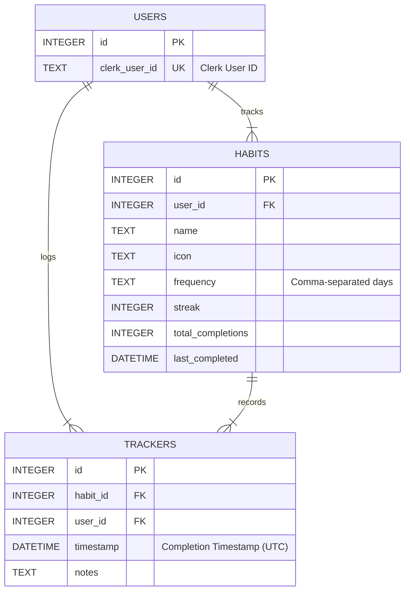

# Entity Relationship Diagram (ERD)

This document provides a visual representation of the database schema for the TrackNStick API, along with explanations of the entities and their relationships.

## Diagram

## Entity Explanations

### 1. USERS
*   **Represents:** An individual user of the TrackNStick application.
*   **Key Attributes:**
    *   `id` (Primary Key): A unique internal identifier for each user.
    *   `clerk_user_id` (Unique Key): The external user ID from the Clerk authentication service. This links the local database user to the Clerk user account.
*   **Relationships:**
    *   A `USER` can have many `HABITS` (one-to-many).
    *   A `USER` can have many `TRACKERS` (one-to-many).

### 2. HABITS
*   **Represents:** A specific habit that a user wants to track.
*   **Key Attributes:**
    *   `id` (Primary Key): A unique identifier for each habit.
    *   `user_id` (Foreign Key): Links the habit to the `USERS` table, indicating which user owns this habit.
    *   `name`: The name of the habit (e.g., "Exercise", "Read a book").
    *   `icon`: An optional icon associated with the habit.
    *   `frequency`: Stores how often the habit is intended to be performed (e.g., specific days of the week, daily). The format is a comma-separated string of day numbers (0=Sunday, 1=Monday, etc.).
    *   `streak`: The current number of consecutive completion periods for the habit.
    *   `total_completions`: The total number of times this habit has been marked as completed.
    *   `last_completed`: The timestamp of the most recent completion for this habit.
*   **Relationships:**
    *   Belongs to one `USER` (many-to-one, via `user_id`).
    *   Can have many `TRACKERS` (one-to-many), representing each time the habit was completed.

### 3. TRACKERS
*   **Represents:** A single completion record for a specific habit by a user on a particular date/time.
*   **Key Attributes:**
    *   `id` (Primary Key): A unique identifier for each tracking entry.
    *   `habit_id` (Foreign Key): Links the tracking entry to the specific `HABITS` table entry that was completed.
    *   `user_id` (Foreign Key): Links the tracking entry to the `USERS` table, indicating which user completed it (this is often redundant if accessing through `HABITS` but can be useful for direct queries on trackers).
    *   `timestamp`: The exact date and time (in UTC) when the habit was marked as completed.
    *   `notes`: Optional notes or details about that specific completion.
*   **Relationships:**
    *   Belongs to one `HABIT` (many-to-one, via `habit_id`).
    *   Belongs to one `USER` (many-to-one, via `user_id`).

## Relationship Summary

*   **USERS to HABITS:** A user can create and track multiple habits. Each habit is owned by a single user.
*   **USERS to TRACKERS:** A user logs multiple tracker entries across all their habits. Each tracker entry is associated with a specific user.
*   **HABITS to TRACKERS:** A habit can be completed multiple times, with each completion being a tracker entry. Each tracker entry corresponds to one specific habit.

This schema structure allows for flexible habit definition, detailed tracking of completions, and association of all data back to individual users. Foreign key constraints with CASCADE delete are used to maintain data integrity (e.g., if a user is deleted, their habits and trackers are also deleted).
