# Habit Tracker API Documentation

## Table of Contents
- [Habit Tracker API Documentation](#habit-tracker-api-documentation)
  - [Table of Contents](#table-of-contents)
  - [Features](#features)
  - [Tech Stack](#tech-stack)
  - [Visual Overview](#visual-overview)
    - [High-Level Architecture](#high-level-architecture)
    - [Simplified Database ERD](#simplified-database-erd)
  - [API Reference](#api-reference)
    - [Base URL](#base-url)
    - [Authentication](#authentication-clerk-jwt)
    - [Response Format](#response-format)
    - [Rate Limiting](#rate-limiting)
    - [API Versioning](#api-versioning)
  - [Getting Started](#getting-started)
    - [Prerequisites](#prerequisites-nodejs-pnpm-fnm-wrangler-cli)
    - [Setup and Installation](#setup-and-installation)
    - [Running the Application](#running-the-application)
    - [Running Tests](#running-tests)
  - [Development Guide](#development-guide)
    - [Onboarding New Developers](#onboarding-new-developers)
    - [Directory Structure Overview](#directory-structure-overview)
    - [Coding Standards](#coding-standards)
    - [Testing](#testing)
    - [Database Interactions & Migrations (Cloudflare D1)](#database-interactions--migrations-cloudflare-d1)
    - [Error Handling](#error-handling)
    - [Logging](#logging)
    - [API Versioning](#api-versioning)
    - [Security Considerations](#security-considerations)
  - [Project Overview & Refactoring](#project-overview--refactoring)
  - [Migration History & Key Changes](#migration-history--key-changes)
    - [Node.js Version Management (fnm)](#nodejs-version-management-fnm)
    - [Package Management (pnpm)](#package-management-pnpm)
    - [Framework Migration (Hono.js on Cloudflare Workers)](#framework-migration-honojs-on-cloudflare-workers)
    - [Database Migration (Cloudflare D1 & Schema Changes)](#database-migration-cloudflare-d1--schema-changes)
  - [High-Level Architecture](#high-level-architecture-1)
  - [Database Structure](#database-structure)
  - [Change History](#change-history)
  - [Future Enhancements](#future-enhancements)
  - [Key Documentation Files](#key-documentation-files)

This is a RESTful API for the Habit Tracker application, built with Node.js, powered by the Hono.js framework, and deployed on Cloudflare Workers, using Cloudflare D1 as its database.

## Features

- Create, Read, Update, and Delete (CRUD) habits.
- Track habit completions for specific dates (toggle on/off).
- Retrieve habit statistics (streak, total completions, last completed date).
- Track daily progress with completion rates and streaks.
- View historical completion data with daily completion percentages.
- Monitor current and longest streaks of 100% completion days.
- Secure endpoints using Clerk JWT authentication.

## Tech Stack

- **Backend:** Node.js
- **Framework:** Hono.js
- **Database:** Cloudflare D1 (SQLite)
- **Deployment:** Cloudflare Workers
- **Linting/Formatting:** ESLint, Prettier

## Visual Overview

### High-Level Architecture

```mermaid
graph LR
    Client -->|"HTTP Request\nGET POST PUT DELETE"| HonoApp[Hono App];
    HonoApp -->|"Request"| Middleware["Middleware <br> (CORS, Authentication)"];
    Middleware -->|"Authenticated Request"| Routes["API Routes <br> (/api/v1/...)"];
    Routes -->|"Params, Body"| Controller["Controller <br> (e.g., habit.controller.ts)"];
    Controller -->|"Data Request"| Service["Service Layer <br> (e.g., habit.service.ts)"];
    Service -->|"DB Operations"| Repository["Repository Layer <br> (e.g., habit.repository.ts)"];
    Repository -->|"D1 Client API"| D1["Cloudflare D1 <br> (SQLite-compatible)"];
    D1 -->|"Query Results"| Repository;
    Repository -->|"Data Models"| Service;
    Service -->|"Processed Data / DTOs"| Controller;
    Controller -->|"Hono c.json()"| HonoApp;
    HonoApp -->|"HTTP Response"| Client;

    subgraph "Application Layers (src/)"
        Controller["Controllers (src/controllers)"]
        Service["Services (src/services)"]
        Repository["Repositories (src/repositories)"]
    end

    subgraph "Framework & Runtime"
        HonoApp
        Middleware
        Routes
    end

    subgraph "Cloudflare Infrastructure"
        D1
        CloudflareWorkers["Cloudflare Workers Runtime"]
    end

    HonoApp --> CloudflareWorkers
```



### Simplified Database ERD (Entity Relationship Diagram)

```mermaid
erDiagram
    USERS ||--|{ HABITS : "tracks"
    USERS ||--|{ TRACKERS : "logs"
    HABITS ||--|{ TRACKERS : "records"
    TRACKERS }|--|| PROGRESS : "aggregated into"

    USERS {
        text clerk_user_id PK "Clerk User ID"
        datetime created_at
        datetime updated_at
    }

    HABITS {
        int id PK "Auto-increment"
        text user_id FK "References USERS.clerk_user_id"
        text name
        text icon
        text frequency "JSON string for frequency rules"
        int streak
        int longest_streak
        int total_completions
        datetime last_completed
        text start_date "YYYY-MM-DD"
        text end_date "YYYY-MM-DD, optional"
        datetime created_at
        datetime updated_at
    }

    TRACKERS {
        int id PK "Auto-increment"
        int habit_id FK "References HABITS.id"
        text user_id FK "References USERS.clerk_user_id"
        datetime timestamp "Completion Timestamp (UTC ISO8601)"
        text notes "Optional"
        text date_tracked "YYYY-MM-DD of completion"
        datetime created_at
        datetime updated_at
    }

    PROGRESS {
        text date PK "YYYY-MM-DD"
        text user_id PK FK "References USERS.clerk_user_id"
        real completion_rate "0.0 to 1.0"
        int current_streak_days
        int longest_streak_days
        datetime created_at
        datetime updated_at
    }
```
*Note: `USERS.id PK (INTEGER)` from the original ERD is likely replaced by `clerk_user_id (TEXT)` as the primary means of identification and for foreign keys, reflecting a tighter integration with Clerk as the user source of truth. The `frequency` field in `HABITS` is now a JSON string.*

## Authentication (Clerk JWT)

API endpoints are protected using [Clerk](https://clerk.com/). Requests must include a valid JWT session token obtained from your Clerk frontend application in the `Authorization: Bearer <token>` header. The backend (Hono.js application on Cloudflare Workers) verifies this token using appropriate Clerk middleware or validation strategies designed for serverless environments (e.g., using `clerk/backend` or `clerk/hono`).

## Rate Limiting

To prevent abuse, API requests are rate-limited. Default policies (e.g., 100 requests per 15-minute window per IP) may be in place. Exceeding the limit results in a `429 Too Many Requests` error. Specifics are detailed in the [API Reference Document](./API_REFERENCE.md#rate-limiting).

## Prerequisites (Node.js, pnpm, fnm, Wrangler CLI)

- **Node.js:** Version as specified in the `.node-version` file (e.g., v20.12.2). It's highly recommended to use `fnm` (Fast Node Manager) for Node.js version management.
  - Install `fnm`: Follow instructions on the [fnm GitHub page](https://github.com/Schniz/fnm). (e.g., `brew install fnm` on macOS).
  - Configure your shell for `fnm` (e.g., `eval "$(fnm env --use-on-cd)" >> ~/.zshrc && source ~/.zshrc`).
- **pnpm:** This project uses `pnpm` for package management due to its efficiency.
  - Install `pnpm` globally: `npm install -g pnpm` (after installing Node.js/npm).
- **Wrangler CLI:** Cloudflare's command-line tool for developing and deploying Workers.
  - Install `wrangler`: `pnpm install -g wrangler` (or `npm install -g wrangler`).
  - Login to Cloudflare: `wrangler login`.

## Setup and Installation

1.  **Clone the repository:**
    ```bash
    git clone https://github.com/jayvicsanantonio/tracknstick-api.git
    cd tracknstick-api
    ```
2.  **Install dependencies:**
    ```bash
    pnpm install # Installs dependencies defined in pnpm-lock.yaml
    ```
    *Note: This project uses `fnm` for Node.js version management and `pnpm` for package management. Ensure `fnm use` is run first if you have `fnm` installed to use the correct Node.js version.*

3.  **Set up Environment Variables (for Local Development):**
    *   Create a file named `.dev.vars` in the project root (this file is specified in `.gitignore` and should not be committed).
    *   Add the following variables, replacing placeholders with your actual Clerk **test** keys:
      ```ini
      # .dev.vars
      CLERK_SECRET_KEY="sk_test_YOUR_SECRET_KEY_HERE"
      # CLERK_PUBLISHABLE_KEY="pk_test_YOUR_PUBLISHABLE_KEY_HERE" # Primarily for frontend but useful for reference

      # NODE_ENV can be set here if needed, e.g., NODE_ENV="development"
      # Other variables like RATE_LIMIT_WINDOW_MS, RATE_LIMIT_MAX_REQUESTS if used by the application
      ```
    *   **Important:** For deployed environments (preview, production), secrets like `CLERK_SECRET_KEY` must be set directly in the Cloudflare dashboard or via `wrangler secret put`.

4.  **Database Setup (Cloudflare D1):**
    *   The database schema is managed using SQL migration files located in the `migrations/` directory.
    *   Ensure your `wrangler.toml` file has the correct D1 database `binding` (e.g., `DB`), `database_name`, and `database_id`.
    *   To apply migrations to your **local** D1 development instance (used by `wrangler dev --local`):
      ```bash
      # Example: pnpm run migrate:local or wrangler d1 migrations apply <YOUR_D1_DATABASE_NAME_FROM_WRANGLER.TOML> --local
      pnpm run db:migrate:local 
      ```
    *   To apply migrations to your **remote** D1 database (e.g., production or preview):
      ```bash
      # Example: pnpm run migrate or wrangler d1 migrations apply <YOUR_D1_DATABASE_NAME_FROM_WRANGLER.TOML> --remote
      pnpm run db:migrate 
      ```
    *   These `pnpm` scripts are typically defined in `package.json` and wrap the `wrangler d1 migrations apply ...` commands.
    *   **Important:** Database setup (creating the D1 database via Cloudflare dashboard or `wrangler d1 create` and applying migrations) must be done before starting the application if it relies on the database immediately.

## Running the Application

- **Local Development (with local D1 and local Worker runtime):**
  ```bash
  pnpm run dev # This script usually runs `wrangler dev --local`
  ```
  The API will typically be available at `http://localhost:8787` (the default port for `wrangler dev`).

- **Local Development (connected to remote D1 preview/production - less common for typical dev):**
  ```bash
  # Ensure your wrangler.toml is configured for the desired remote environment
  wrangler dev --remote 
  ```

- **Production Deployment:**
  ```bash
  pnpm run deploy # This script usually runs `wrangler deploy src/index.ts --env production` (or similar based on wrangler.toml)
  ```

## Database Migrations

Database schema changes are managed using SQL files in the `migrations/` directory and applied using Wrangler CLI.

- **Apply Migrations Locally:**
  ```bash
  # Assumes 'DB' is your D1 binding and 'tracknstick-db-dev' is a local alias in wrangler.toml or the target for --local
  pnpm run db:migrate:local 
  # Example underlying command: wrangler d1 migrations apply tracknstick-db --local
  ```
- **Apply Migrations to Remote Database:**
  ```bash
  pnpm run db:migrate
  # Example underlying command: wrangler d1 migrations apply tracknstick-db-prod --remote (if you have specific prod config)
  # Or simply: wrangler d1 migrations apply tracknstick-db (if deploying to default env in wrangler.toml)
  ```
- **Execute Ad-hoc SQL Queries Locally:**
  ```bash
  # Example: pnpm run db:query:local -- "SELECT * FROM users"
  pnpm run db:query:local -- "YOUR SQL QUERY HERE"
  # Example underlying command: wrangler d1 execute tracknstick-db --local --command "SELECT * FROM users"
  ```
- **Execute Ad-hoc SQL Queries on Remote Database:**
  ```bash
  # Example: pnpm run db:query -- "SELECT * FROM users"
  pnpm run db:query -- "YOUR SQL QUERY HERE"
  # Example underlying command: wrangler d1 execute tracknstick-db-prod --remote --command "SELECT * FROM users"
  ```

## Running Tests

```bash
pnpm test
```
This command will execute the test suite (likely using Vitest, as mentioned in other documents). Refer to `package.json` for specific test scripts (e.g., for coverage, watch mode).

## API Reference

The TrackNStick API is a RESTful API built with Hono.js and running on Cloudflare Workers. It provides endpoints for habit management, tracking, and progress analytics.

For detailed endpoint specifications, request/response examples, and more, please see:
- [API Reference Document](./API_REFERENCE.md)
- [API Usage Examples](./API_EXAMPLES.md)

### Base URL
The API is versioned using the URL path.
- **Local Development (Wrangler):** `http://localhost:8787/api/v1`
- **Production:** `https://tracknstick.jayvicsanantonio.workers.dev/api/v1` (Actual production URL)

### Authentication
Authentication is handled via Clerk JWTs. See [API Reference Document](./API_REFERENCE.md#authentication-clerk-jwt) for details.

### Response Format
Standardized JSON responses are used. See [API Reference Document](./API_REFERENCE.md#standard-response-format) for success and error formats.

### Rate Limiting
API requests are rate-limited. See [API Reference Document](./API_REFERENCE.md#rate-limiting) for details.

### API Versioning
The API is versioned via the URL: `/api/v1/`. Breaking changes will increment the version.

## Project Overview & Refactoring

A significant refactoring effort was completed to modernize the stack, improving maintainability, testability, and performance. This involved migrating to Hono.js, Cloudflare Workers for deployment, and Cloudflare D1 as the database.

Key refactoring details and decisions can be found in:
- [Architecture Document](./ARCHITECTURE.md)
- [Development Guide (Maintainability, Performance, Learnings sections)](./DEVELOPMENT_GUIDE.md#9-maintainability-performance-enhancements-learnings)

## Development Guide

This section provides a brief overview for developers. For comprehensive information, refer to the main [Development Guide](./DEVELOPMENT_GUIDE.md).

### Onboarding New Developers
Welcome! This API uses Hono.js on Cloudflare Workers with D1. Key points:
- Layered architecture: Routes -> Controllers -> Services -> Repositories.
- Middleware for CORS, authentication (Clerk), logging, validation (Zod).
- TypeScript, Vitest for testing.
Familiarize yourself with the "Setup and Installation" and "Running the Application" sections.

### Directory Structure Overview
The project structure is organized for clarity:
```
tracknstick-api/
├── .github/          # GitHub Actions for CI/CD
├── docs/             # Project documentation (this file, API_REFERENCE.md, etc.)
├── migrations/       # SQL database migration files for Cloudflare D1
├── src/              # Source code
│   ├── controllers/  # Hono controllers
│   ├── middlewares/  # Hono middleware
│   ├── repositories/ # D1 data access
│   ├── routes/       # API route definitions
│   ├── services/     # Business logic
│   ├── types/        # TypeScript types
│   ├── utils/        # Shared utilities
│   └── validators/   # Zod validation schemas
├── tests/            # Unit and integration tests
├── .eslintrc.json    # ESLint config
├── .node-version     # fnm Node.js version
├── package.json      # Dependencies and pnpm scripts
├── tsconfig.json     # TypeScript config
└── wrangler.toml     # Cloudflare Workers config
```

### Coding Standards
- **Formatting & Linting:** Use Prettier and ESLint. Run `pnpm format` and `pnpm lint`.
- **Naming Conventions & Style:** See details in the [Development Guide](./DEVELOPMENT_GUIDE.md#4-coding-standards).
- **Comments & Modularity:** Document complex logic; keep functions focused.
- **TypeScript & Error Handling:** Utilize strong typing; use custom errors.
- **Testing:** Write tests for new features/fixes.

### Testing
Uses Vitest. Run `pnpm test`. More details in [Development Guide](./DEVELOPMENT_GUIDE.md#7-testing-guide).

### Database Interactions & Migrations (Cloudflare D1)
- **Repository Layer:** Handles D1 interactions (`src/repositories/`).
- **Migrations:** SQL files in `migrations/`, applied via `wrangler d1 migrations apply`. Details in "Database Migrations" section above and [Database Document](./DATABASE.md#3-database-migrations).

### Error Handling, Logging, API Versioning, Security
Refer to the main [Development Guide](./DEVELOPMENT_GUIDE.md) for details on these topics.

## Migration History & Key Changes

### Node.js Version Management (fnm)
The project uses `fnm` to manage Node.js versions, specified in `.node-version`.

### Package Management (pnpm)
`pnpm` is used for its efficiency. Use `pnpm install`, `pnpm run <script>`, etc.

### Framework Migration (Hono.js on Cloudflare Workers)
The API was refactored from an older stack to Hono.js, running on Cloudflare Workers for improved performance and scalability. This involved adopting TypeScript, Zod for validation, and Vitest for testing.

### Database Migration (Cloudflare D1 & Schema Changes)
The database was migrated to Cloudflare D1. Key schema changes (e.g., May 2023) include:
- `habits.frequency` column now stores a JSON string.
- `habits` table includes `longest_streak`, `total_completions`, `last_completed`, `start_date`, `end_date`.
- User identification primarily relies on `clerk_user_id`.
Refer to [Database Document](./DATABASE.md#2-database-schema) for the current schema.

*(For a detailed history of all changes, see the [Changelog](./CHANGELOG.md).)*

## High-Level Architecture
The API employs a layered architecture (Routes -> Controllers -> Services -> Repositories) optimized for Cloudflare Workers.
For a detailed explanation, see the [Architecture Document](./ARCHITECTURE.md).

## Database Structure
Uses Cloudflare D1 (SQLite-compatible). Key tables include `users`, `habits`, `trackers`, and `progress`.
For detailed schema, see the [Database Document](./DATABASE.md).

## Change History
All notable changes are documented in the [Changelog](./CHANGELOG.md).

## Future Enhancements
Planned improvements include enhancing test coverage, creating detailed troubleshooting guides, and exploring advanced scalability and monitoring solutions. See [Development Guide](./DEVELOPMENT_GUIDE.md#9-maintainability-performance-enhancements-learnings) for more.

## Key Documentation Files
*   **This Document (`INDEX.md`):** Overview and entry point.
*   **[API Reference](./API_REFERENCE.md):** Detailed API endpoint specifications.
*   **[API Examples](./API_EXAMPLES.md):** Practical usage examples.
*   **[Architecture Document](./ARCHITECTURE.md):** In-depth architectural details.
*   **[Database Document](./DATABASE.md):** Schema, migrations, and query info.
*   **[Development Guide](./DEVELOPMENT_GUIDE.md):** Comprehensive guide for developers.
*   **[Deployment Guide](./deployment.md):** Instructions for deploying the API. *(Note: filename is lowercase)*
*   **[Monitoring Guide](./MONITORING.md):** Information on monitoring the application.
*   **[Troubleshooting Guide](./TROUBLESHOOTING.md):** Help with common issues.
*   **[Changelog](./CHANGELOG.md):** History of changes to the application.
