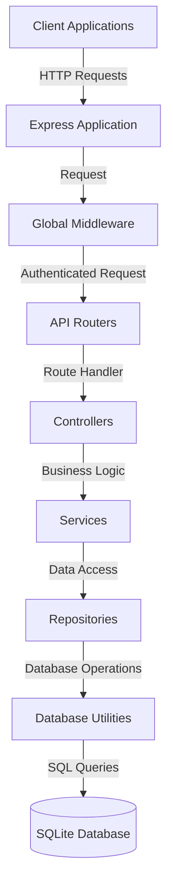

# Architecture Overview

This document provides a high-level overview of the TracknStick API architecture.

## System Architecture

The TracknStick API follows a layered architecture pattern, which separates concerns and promotes maintainability.

## Layer Responsibilities

### API Layer (`src/api/`)

- Defines all routes for the application
- Connects routes to appropriate controller methods
- Applies middleware for specific routes (validation, etc.)
- No business logic should exist here

### Controller Layer (`src/controllers/`)

- Handles HTTP request/response cycle
- Extracts and validates input from requests
- Calls appropriate service methods
- Formats responses to the client
- Does not contain business logic
- Error handling via next(error)

### Service Layer (`src/services/`)

- Contains all business logic
- Implements application rules and workflows
- Orchestrates calls to repositories
- Performs data transformation and validation
- May throw custom errors for specific scenarios
- No direct database access

### Repository Layer (`src/repositories/`)

- Abstracts database interactions
- Contains SQL queries and database operations
- Returns plain data objects
- Handles database-specific errors
- No business logic

### Utilities (`src/utils/`)

- Shared helper functions used across the application
- Database utilities (`dbUtils.js`)
- Date formatting utilities (`dateUtils.js`)
- Transaction utilities (`transactionUtils.js`)
- Streak calculation utilities (`streakUtils.js`)
- Custom error classes (`errors.js`)

### Middleware (`src/middlewares/`)

- Authentication middleware
- Error handling middleware
- Validation middleware
- Logging middleware
- Rate limiting middleware

### Validators (`src/validators/`)

- Input validation rules
- Schema definitions for requests

## Data Flow

1. Client makes HTTP request to an endpoint
2. Request passes through global middleware
3. Router directs request to appropriate controller method
4. Controller validates request and calls service method
5. Service executes business logic and calls repository methods
6. Repository performs database operations
7. Results flow back up through the layers
8. Controller formats the final response to the client

## Key Architectural Principles

1. **Separation of Concerns**: Each layer has specific responsibilities
2. **Dependency Flow**: Dependencies flow downward only
3. **Single Responsibility**: Each function and module has a clear, single purpose
4. **Error Centralization**: Errors are handled centrally via middleware
5. **Data Ownership**: Data access is controlled via user authentication and authorization

## Design Patterns

- **Repository Pattern**: Abstraction layer between business logic and data access
- **Middleware Pattern**: Chain of responsibility for request processing
- **Service Layer Pattern**: Encapsulation of business logic
- **Centralized Error Handling**: Consistent error management

## Authentication Flow

Authentication is handled by Clerk, a third-party authentication service:

1. Client authenticates with Clerk and receives a JWT token
2. JWT token is included in API requests in the Authorization header
3. Middleware verifies the token with Clerk
4. User identity (Clerk User ID) is extracted from the token
5. Local user record is fetched or created based on the Clerk User ID

For more details, see [Architecture Decisions](decisions.md) and [Code Organization](code-organization.md).

Last Updated: 2024-03-21
