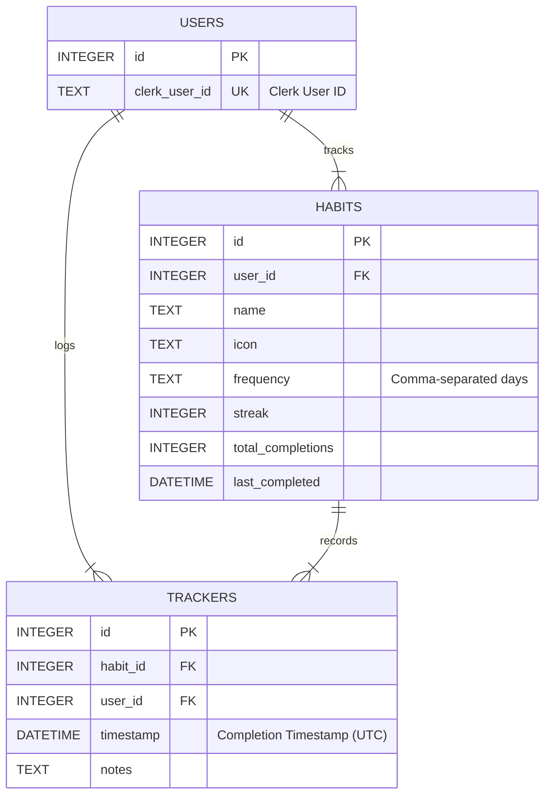

# Database Schema

This document provides a detailed description of the TracknStick API database schema.

## Overview

The TracknStick API uses SQLite as its database, with a schema designed to efficiently store and manage habit tracking data. The database consists of three main tables:

1. `users` - Stores user information
2. `habits` - Stores habit definitions
3. `trackers` - Stores habit completion records

## Entity Relationship Diagram (ERD)



## Table Definitions

### Users Table

The `users` table stores basic user information and links to the Clerk authentication system.

| Column        | Type    | Constraints      | Description                                        |
| ------------- | ------- | ---------------- | -------------------------------------------------- |
| id            | INTEGER | PRIMARY KEY      | Auto-incrementing unique identifier                |
| clerk_user_id | TEXT    | NOT NULL, UNIQUE | External user ID from Clerk authentication service |

#### Indexes

- Primary Key: `id`
- Unique Key: `clerk_user_id`

### Habits Table

The `habits` table stores information about each habit being tracked.

| Column            | Type     | Constraints           | Description                                                                                |
| ----------------- | -------- | --------------------- | ------------------------------------------------------------------------------------------ |
| id                | INTEGER  | PRIMARY KEY           | Auto-incrementing unique identifier                                                        |
| user_id           | INTEGER  | NOT NULL, FOREIGN KEY | Reference to the user who owns this habit                                                  |
| name              | TEXT     | NOT NULL              | Name of the habit                                                                          |
| icon              | TEXT     |                       | Optional icon identifier for the habit                                                     |
| frequency         | TEXT     | NOT NULL              | Comma-separated list of days when the habit should be performed (0=Sunday, 1=Monday, etc.) |
| streak            | INTEGER  | DEFAULT 0             | Current streak count for the habit                                                         |
| total_completions | INTEGER  | DEFAULT 0             | Total number of times the habit has been completed                                         |
| last_completed    | DATETIME |                       | Timestamp of the most recent completion                                                    |

#### Indexes

- Primary Key: `id`
- Foreign Key: `user_id` references `users(id)` with CASCADE delete
- Index: `idx_habits_user_frequency` on `(user_id, frequency)` for efficient filtering by day

### Trackers Table

The `trackers` table records each instance of habit completion.

| Column    | Type     | Constraints           | Description                                   |
| --------- | -------- | --------------------- | --------------------------------------------- |
| id        | INTEGER  | PRIMARY KEY           | Auto-incrementing unique identifier           |
| habit_id  | INTEGER  | NOT NULL, FOREIGN KEY | Reference to the completed habit              |
| user_id   | INTEGER  | NOT NULL, FOREIGN KEY | Reference to the user who completed the habit |
| timestamp | DATETIME | NOT NULL              | When the habit was completed (UTC)            |
| notes     | TEXT     |                       | Optional notes about the completion           |

#### Indexes

- Primary Key: `id`
- Foreign Key: `habit_id` references `habits(id)` with CASCADE delete
- Foreign Key: `user_id` references `users(id)` with CASCADE delete
- Index: `idx_trackers_habit_user_ts` on `(habit_id, user_id, timestamp)` for efficient lookups

## Relationships

1. **User to Habits**: One-to-many relationship. A user can have multiple habits, but each habit belongs to only one user.
2. **User to Trackers**: One-to-many relationship. A user can have multiple tracker records, but each tracker record belongs to only one user.
3. **Habit to Trackers**: One-to-many relationship. A habit can have multiple completion records, but each completion record belongs to only one habit.

## Data Integrity

The schema ensures data integrity through the following mechanisms:

1. **Primary Keys**: Each table has a unique identifier.
2. **Foreign Keys**: Relationships between tables are enforced with foreign key constraints.
3. **CASCADE Deletes**: When a user or habit is deleted, all associated records are automatically deleted.
4. **NOT NULL Constraints**: Critical fields cannot be null.
5. **Default Values**: Fields like `streak` and `total_completions` have default values.

## Frequency Format

The `frequency` column in the `habits` table stores days of the week as a comma-separated string of integers:

- `0` = Sunday
- `1` = Monday
- `2` = Tuesday
- `3` = Wednesday
- `4` = Thursday
- `5` = Friday
- `6` = Saturday

Examples:

- `"1,3,5"` = Monday, Wednesday, Friday
- `"0,6"` = Weekends (Saturday and Sunday)
- `"1,2,3,4,5"` = Weekdays
- `"0,1,2,3,4,5,6"` = Every day

## Data Types

SQLite has a dynamic type system, but the application enforces the following types:

1. **INTEGER**: Used for IDs and numeric counts.
2. **TEXT**: Used for strings, including the `frequency` field which is stored as a formatted string.
3. **DATETIME**: Stored in ISO 8601 format (`YYYY-MM-DD HH:MM:SS.SSS`).

## Indexing Strategy

Indexes are created for frequently queried columns to improve performance:

1. `idx_habits_user_frequency`: Improves queries that filter habits by user and day of week.
2. `idx_trackers_habit_user_ts`: Improves queries that retrieve habit completion history.

## Example Data

### Sample Users Record

```json
{
  "id": 1,
  "clerk_user_id": "user_2nZDEPfVLr7qGMYRRnhgLQ8SQaZ"
}
```

### Sample Habits Record

```json
{
  "id": 1,
  "user_id": 1,
  "name": "Morning Meditation",
  "icon": "meditation",
  "frequency": "1,2,3,4,5",
  "streak": 7,
  "total_completions": 23,
  "last_completed": "2023-01-15T08:30:00.000Z"
}
```

### Sample Trackers Record

```json
{
  "id": 1,
  "habit_id": 1,
  "user_id": 1,
  "timestamp": "2023-01-15T08:30:00.000Z",
  "notes": "Felt very focused today"
}
```

## Schema Evolution

The schema is designed to be extensible. Future enhancements might include:

1. **Categories**: Adding a category field to habits for better organization.
2. **Reminders**: A new table to store reminder settings for habits.
3. **Metrics**: Additional fields for habits to track metrics like duration or intensity.
4. **Tags**: A tagging system for habits and completions.

## Best Practices

When working with this schema:

1. **Always filter by user_id**: To ensure data security, always include `user_id` in WHERE clauses.
2. **Use transactions**: For operations that affect multiple tables, use transactions to ensure data consistency.
3. **Date handling**: Be mindful of timezone differences when working with the `timestamp` field.
4. **Indexing**: Consider query patterns when adding new fields that might need indexing.

Last Updated: 2024-03-21
