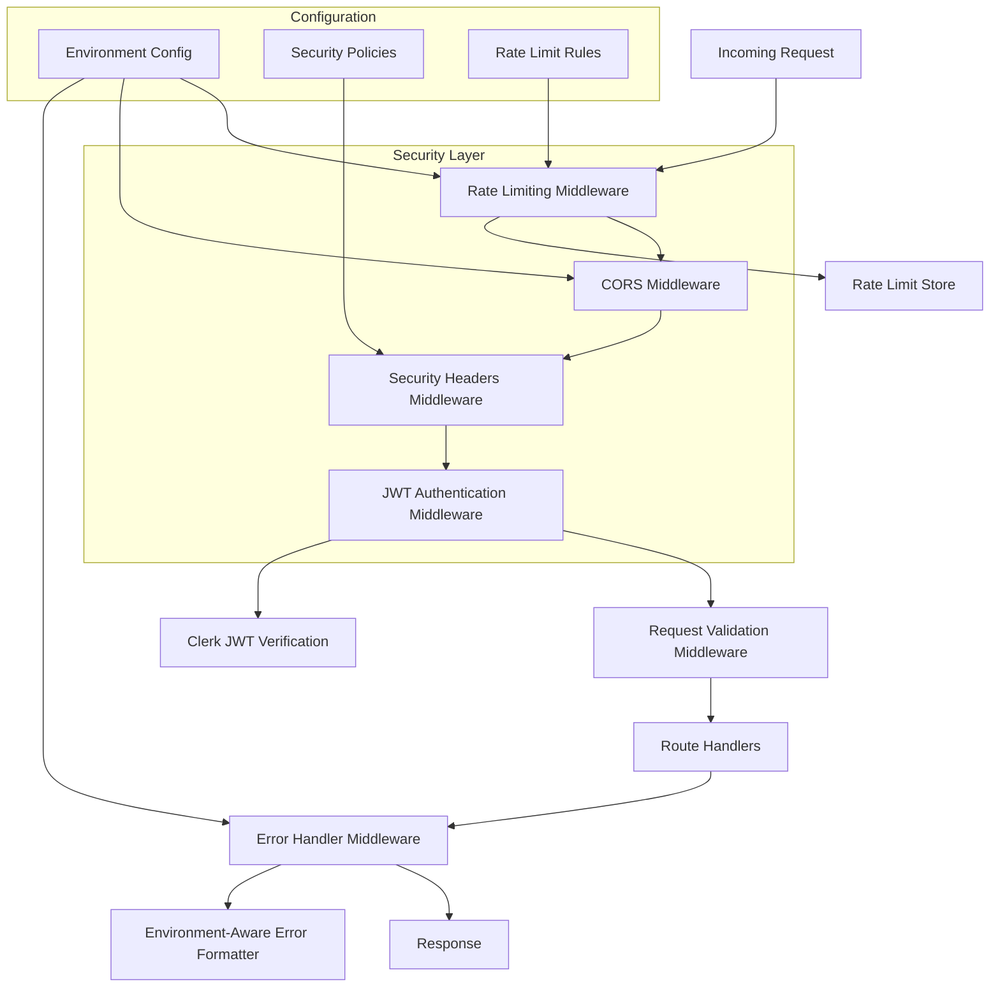

# Design Document

## Overview

The security improvements will be implemented through a comprehensive redesign of the authentication middleware, introduction of production-grade rate limiting, environment-aware security configuration, and hardened error handling. The design maintains backward compatibility while addressing all identified vulnerabilities through a layered security approach.

The solution leverages Cloudflare Workers' edge computing capabilities, integrates properly with Clerk's authentication service, and implements defense-in-depth principles. All security measures will be configurable per environment to maintain development productivity while ensuring production security.

## Architecture



## Components and Interfaces

### Enhanced JWT Authentication Middleware
**Location:** `src/middlewares/clerkMiddleware.ts`

**Purpose:** Replace unsafe token parsing with proper Clerk JWT verification

**Interface:**
```typescript
interface ClerkMiddleware {
  verifyToken(token: string, secretKey: string): Promise<ClerkUser>
  extractClaims(verifiedToken: ClerkUser): AuthContext
  handleVerificationError(error: ClerkError): UnauthorizedError
}

interface AuthContext {
  userId: string
  sessionId: string
  claims: Record<string, any>
}
```

**Key Changes:**
- Replace `JSON.parse(atob(token))` with `clerk.verifyToken(token)`
- Add proper error handling for token verification
- Implement token claim extraction and validation
- Add request context enrichment with verified user data

### Production Rate Limiting System
**Location:** `src/middlewares/rateLimit.ts`

**Purpose:** Implement robust rate limiting with configurable policies

**Interface:**
```typescript
interface RateLimitConfig {
  globalLimit: number
  windowMs: number
  endpointLimits: Record<string, EndpointLimit>
  skipSuccessfulRequests: boolean
  skipFailedRequests: boolean
}

interface EndpointLimit {
  limit: number
  windowMs: number
  skipIf?: (req: Request) => boolean
}
```

**Enhanced Features:**
- Per-endpoint rate limiting configuration
- IP-based and user-based limiting
- Sliding window implementation
- Configurable exemptions for health checks
- Rate limit headers compliance (RFC 6585)

### Environment-Aware Security Configuration
**Location:** `src/config/security.ts`

**Purpose:** Centralize security configuration with environment awareness

**Interface:**
```typescript
interface SecurityConfig {
  cors: CorsConfig
  rateLimit: RateLimitConfig
  errorHandling: ErrorConfig
  headers: SecurityHeadersConfig
}

interface CorsConfig {
  origins: string[]
  methods: string[]
  allowedHeaders: string[]
  credentials: boolean
}

interface ErrorConfig {
  showStackTrace: boolean
  showErrorDetails: boolean
  logLevel: LogLevel
}
```

### Hardened Error Handler
**Location:** `src/middlewares/errorHandler.ts`

**Purpose:** Prevent information disclosure while maintaining debugging capability

**Interface:**
```typescript
interface ErrorResponse {
  error: {
    message: string
    code: string
    details?: any // Only in development
    requestId: string
  }
}

interface ErrorContext {
  environment: string
  requestId: string
  userId?: string
  path: string
  method: string
}
```

## Data Models

### Security Event Logging
```typescript
interface SecurityEvent {
  eventType: 'auth_failure' | 'rate_limit_exceeded' | 'invalid_token' | 'cors_violation'
  timestamp: string
  clientId: string
  endpoint: string
  details: Record<string, any>
  severity: 'low' | 'medium' | 'high' | 'critical'
}
```

### Rate Limit Storage
```typescript
interface RateLimitEntry {
  key: string // "userId:endpoint" or "ip:endpoint"
  count: number
  resetAt: number
  firstRequest: number
}
```

## Error Handling

### Authentication Errors
- **Invalid Token Signature:** 401 with generic "Authentication required" message
- **Expired Token:** 401 with "Authentication required" message  
- **Malformed Token:** 401 with "Authentication required" message
- **Missing Token:** 401 with "Authentication required" message
- **Clerk Service Unavailable:** 503 with "Service temporarily unavailable"

### Rate Limiting Errors
- **Limit Exceeded:** 429 with "Too many requests" and retry-after header
- **Invalid Rate Limit Config:** 500 with "Internal server error"

### Configuration Errors
- **Invalid Environment:** Default to production security settings
- **Missing Clerk Secret:** 500 with "Service configuration error"
- **Invalid CORS Origin:** Block request with 403

### Error Response Format
**Production:**
```json
{
  "error": {
    "message": "Authentication required",
    "code": "unauthorized",
    "requestId": "req_123456"
  }
}
```

**Development:**
```json
{
  "error": {
    "message": "JWT verification failed: token signature invalid",
    "code": "unauthorized", 
    "requestId": "req_123456",
    "details": {
      "tokenClaims": {...},
      "verificationError": "..."
    }
  }
}
```

## Testing Strategy

### Unit Tests
- **JWT Middleware:** Mock Clerk client, test token verification flows
- **Rate Limiting:** Test limit enforcement, window resets, cleanup
- **Error Handler:** Test environment-specific response formatting
- **Security Config:** Test environment detection and config loading

### Integration Tests  
- **Authentication Flow:** End-to-end token verification with real Clerk
- **Rate Limiting:** Multi-request scenarios across time windows
- **CORS:** Cross-origin request handling in different environments
- **Error Scenarios:** Complete error handling pipeline testing

### Security Tests
- **Token Tampering:** Verify rejection of modified tokens
- **Rate Limit Bypass:** Attempt various bypass techniques
- **Information Disclosure:** Verify no sensitive data in error responses
- **Environment Isolation:** Confirm production settings don't leak to development

### Performance Tests
- **Rate Limiting Overhead:** Measure middleware performance impact
- **JWT Verification:** Test Clerk integration performance
- **Memory Usage:** Monitor rate limit store memory consumption
- **Concurrent Requests:** Test middleware under load